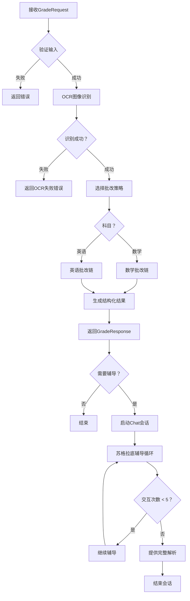

# Homework Agent - 标准作业流程 (SOP)

> Version: 2.0.0
> Last Updated: 2025-01-06
> Status: Active

## 目录
1. [工作流程概览](#1-工作流程概览)
2. [详细作业流程](#2-详细作业流程)
3. [决策树](#3-决策树)
4. [错误处理策略](#4-错误处理策略)
5. [质量保证](#5-质量保证)
6. [安全与隐私](#6-安全与隐私)
7. [性能优化](#7-性能优化)
8. [监控与日志](#8-监控与日志)

---

## 1. 工作流程概览

### 1.0 技术栈与边界

#### 1.0.1 核心架构
- 后端框架：FastAPI 0.100+ (Python 3.10+)；HTTP 直连 LLM/Vision API（OpenAI/Anthropic），不使用 Claude Agent SDK、不依赖 .claude 目录。
- AI 模型：默认 Qwen3（SiliconFlow）作为主力 LLM+Vision，doubao（Ark）作为备选/回退；不对外新增其他 LLM 选项。保留 OpenAI/Anthropic 作为内部备用，不向终端暴露。
- 视觉/OCR：用户可选 `"qwen3"`(SiliconFlow Qwen/Qwen3-VL-32B-Thinking) 或 `"doubao"`(Ark doubao-seed-1-6-vision-250815)，默认 `"qwen3"`；不对外提供 OpenAI 视觉选项。备选 Azure Computer Vision；备用 Tesseract（本地）。
- 数据存储：PostgreSQL (主存)、Redis (缓存/会话)。
- 队列：Celery + Redis（异步任务，可先用内存占位）。
- 部署：Docker；可选 K8s/云函数。

#### 1.0.2 模块划分（建议）
```
homework_agent/
├── main.py              # FastAPI 入口
├── api/                 # 路由层 (/grade, /chat, /jobs)
├── core/                # 业务逻辑：grader/tutor/ocr/prompts
├── models/              # schemas / database
├── services/            # vision/llm/cache 等客户端
├── utils/               # session/validator
└── tests/               # 测试
```

#### 1.0.3 FastAPI 配置规范
- 应用：`app = FastAPI(title="Homework Agent", version="1.0.0")`，DEBUG 依 ENV。
- CORS：仅白名单域，支持凭证。
- 中间件：请求日志、认证、限流、幂等校验（X-Idempotency-Key）。
- 路由：版本前缀 `/api/v1`；依赖注入认证/缓存/会话；响应模型用 Pydantic。
- 异步：`async def` 端点，外部调用用 aiohttp/httpx；SSE/WebSocket 支持流式。
- 错误处理：全局异常处理器统一格式与状态码。

#### 1.0.4 会话/幂等/异步
- 幂等：`X-Idempotency-Key` 头，24h 生命周期；冲突返回 409。
- 同步/异步：小批量/预估 <60s 尽量同步；预估超时/大批量返回 202+job_id，GET /jobs 查询（或回调）。
- 会话：session 24h；辅导链只读当前批次，不读历史画像；长期画像仅写入。

#### 1.0.5 存储与坐标
- 坐标统一归一化 `[ymin, xmin, ymax, xmax]`，原点左上。
- 输出字段：page_image_url/slice_image_url/page_bbox/review_slice_bbox 必填（若缺需说明），steps/geometry 可选 bbox。
- 图像/切片存 OSS，7d TTL；Redis 缓存/会话 24h；PG 持久化错题/历史。

### 1.1 核心流程图



### 1.2 输入/输出标准

| 阶段 | 输入 | 处理 | 输出 |
|------|------|------|------|
| **批改** | GradeRequest(images, subject, mode) | OCR → 分析 → 结构化 | GradeResponse(wrong_items, summary) |
| **辅导** | ChatRequest(history, question) | 上下文理解 → 引导策略 | ChatResponse(messages) 或 SSE流 |
| **会话** | session_id | 状态管理 | 持久化上下文 |

---

## 2. 详细作业流程

### 2.1 阶段1：输入验证与准备

> 幂等：使用 `X-Idempotency-Key` 头；键存在且参数相同返回原结果，参数不同返回 409。

> 同步/异步：小批量/预估 <60s 尝试同步；预估超时或大批量返回 202+job_id，结果通过 GET /jobs/{job_id} 查询（或回调）。

#### SOP-1.1: GradeRequest验证
**触发**: POST /grade

**检查清单**:
```python
✅ 验证字段完整性:
  - images: 1-20张图片，每张<10MB，支持jpg/png/webp
  - subject: math 或 english
  - mode: normal (默认) 或 strict
  - session_id: 可选，24小时有效
  - batch_id: 可选
  - header: X-Idempotency-Key（推荐）

✅ 验证图片格式:
  - 检查文件头判断真实格式
  - 拒绝损坏的图片文件
  - 转换异常记录到warnings

✅ 生成作业ID:
  - 如果没有batch_id，生成格式: batch-{timestamp}-{random4}
  - 如果没有session_id，使用batch_id作为session_id
```

**失败处理**:
- 字段缺失 → 400 Bad Request
- 图片问题 → 422 Unprocessable Entity
- 超过限制 → 413 Payload Too Large
- 幂等冲突 → 409 Conflict

#### SOP-1.2: ChatRequest验证
**触发**: POST /chat

**检查清单**:
```python
✅ 验证字段完整性:
  - history: 最多20条消息
  - question: 非空字符串
  - subject: math 或 english
  - session_id: 必需，24小时有效

✅ 会话状态检查:
  - 检查session_id是否存在于活跃会话中
  - 验证会话是否超时（>24小时）
  - 记录当前交互次数（最多5次）

✅ 上下文关联:
  - 验证context_item_ids是否存在于之前的批改结果中
  - 加载错题详情作为辅导上下文
  - 仅读取当前批次上下文，不读取历史画像；长期画像仅写入不读取
```

### 2.2 阶段2：图像处理与内容识别

#### SOP-2.1: OCR图像处理
**工具**: 直接调用视觉模型 API（OpenAI/Anthropic），可选备用：Azure Computer Vision / Tesseract OCR（非 SDK）

**处理步骤**:
```python
1. 图像预处理:
   ✅ 规范化图像尺寸（最大2048x2048）
   ✅ 调整对比度和清晰度（自动）
   ✅ 检测图像方向并旋转

2. 内容识别:
   ✅ 使用视觉模型 API 分析每张图片（HTTP 直连）
   ✅ 提取文本内容（手写体/印刷体）
   ✅ 识别数学公式、几何图形
   ✅ 检测题目边界和答案区域

3. 结构化输出:
   ✅ 生成OCR JSON: {page_num, text, bbox, confidence}
   ✅ 计算归一化坐标 [ymin, xmin, ymax, xmax]
   ✅ 识别题目分组（基于位置和内容）
```

**质量控制**:
- confidence < 0.7 → 标记为uncertain
- 无法识别的区域 → bbox为null，reason说明
- 跨页内容 → 合并处理

### 2.3 阶段3：批改执行

#### SOP-3.1: 数学批改链
**调用prompt**: `MATH_GRADER_SYSTEM_PROMPT`

**处理逻辑**:
```python
1. 题目解析:
   ✅ 从OCR结果中识别数学题目
   ✅ 分离题干和学生答案
   ✅ 检测题型（计算/几何/应用题）

2. 步骤级验证:
   ✅ 将学生解答分解为步骤
   ✅ 每步与标准解法对比
   ✅ 标记verdict: correct/incorrect/uncertain
   ✅ 分类severity: calculation/concept/format
   ✅ 可选bbox: 为步骤提供归一化bbox（若可信）

3. 几何分析:
   ✅ 识别几何元素（线/角/点）
   ✅ 验证辅助线绘制
   ✅ 检查标注完整性
   ✅ 生成自然语言描述

4. 知识标签:
   ✅ 自动打标 L2/L3 知识点
   ✅ 例: ['数学', '几何', '三角形', '全等判定']

5. 输出结构化:
   ✅ 构建WrongItem数组
   ✅ 只包含incorrect/uncertain的题目
   ✅ 填充所有必需字段：page_image_url/slice_image_url/page_bbox/review_slice_bbox（归一化）、reason/standard_answer、knowledge_tags、cross_subject_flag（仅标记，不切科）
```

**边界情况处理**:
- 部分正确 → 在第一个错误步骤处停止详细分析
- 步骤缺失 → 在missing步骤处提示
- 几何图形模糊 → 使用uncertain verdict

#### SOP-3.2: 英语批改链
**调用prompt**: `ENGLISH_GRADER_SYSTEM_PROMPT`

**处理逻辑**:
```python
1. 答案理解:
   ✅ 提取学生答案和标准答案
   ✅ 忽略格式差异（标点、大小写）

2. 语义相似度计算:
   ✅ 使用LLM计算语义相似度
   ✅ Normal模式: 阈值0.85
   ✅ Strict模式: 阈值0.91 + 关键词检查

3. 关键词提取（Strict模式）:
   ✅ 自动识别标准答案中的1-3个关键术语
   ✅ 验证学生答案包含这些术语（或同义词）
   ✅ 记录keywords_used用于审计

4. 结果评估:
   ✅ 相似度≥阈值 AND 关键词匹配 → correct
   ✅ 否则 → incorrect
   ✅ 计算semantic_score (0-1)，填充 similarity_mode/keywords_used
```

### 2.4 阶段4：辅导对话

#### SOP-4.1: 辅导启动
**触发条件**: 学生问"为什么？"、"怎么做？"等

**前置准备**:
```python
✅ 加载上下文:
  - 从GradeResponse加载wrong_item详情
  - 提取相关math_steps或semantic_score
  - 初始化interaction_count = 0

✅ 设定辅导策略:
  - 选择提示级别（轻提示/方向提示/重提示）
  - 准备引导问题
  - 确保不直接给出答案
```

#### SOP-4.2: 5轮辅导循环
**调用prompt**: `SOCRATIC_TUTOR_SYSTEM_PROMPT`

**轮次策略**:
```python
第1轮 (交互1):
  ✅ 策略: 轻提示
  ✅ 行为: 复述学生正确的部分，指出第一个疑点
  ✅ 示例: "你第1步计算正确，能再检查一下第2步吗？"

第2轮 (交互2):
  ✅ 策略: 方向提示
  ✅ 行为: 指向特定概念/公式/检查点
  ✅ 示例: "回忆一下运算顺序，这里应该先算乘法"

第3轮 (交互3):
  ✅ 策略: 重提示
  ✅ 行为: 指出错误类型（计算/概念/格式）
  ✅ 示例: "你在第2步的乘法计算可能有误"

第4轮 (交互4):
  ✅ 策略: 引导验证
  ✅ 行为: 引导学生逐步验证每步
  ✅ 示例: "我们一起算一遍：3×4等于多少？"

第5轮 (交互5):
  ✅ 策略: 完整解析
  ✅ 行为: 提供详细解答过程
  ✅ 示例: "正确解法是...，你的错误在于..."
```

**状态管理**:
```python
- 每次交互后: interaction_count += 1
- 状态标记: continue/limit_reached/explained
- 超过5次: 自动提供完整解析并结束会话
```

> SSE 心跳/断线：心跳建议 30s；若 90s 内无数据可断开；客户端可用 last-event-id 续接。

### 2.5 阶段5：结果输出

#### SOP-5.1: GradeResponse构建
**结构要求**:
```json
{
  "wrong_items": [/* WrongItem数组 */],
  "summary": "本次批改共检测到X道题，发现Y处错误",
  "subject": "math",
  "job_id": "job-xxx",  // 异步模式时
  "status": "done",
  "total_items": 5,
  "wrong_count": 2,
  "cross_subject_flag": false,
  "warnings": ["可能的警告"]
}
```

**质量检查**:
- wrong_count必须与wrong_items.length一致
- 所有bbox必须在[0,1]范围内
- page_bbox/review_slice_bbox 必须存在且归一化，若不可用需明确原因
- reason必须提供有用反馈
- 必须包含至少一个knowledge_tag

#### SOP-5.2: SSE流式输出
**事件序列**:
```http
1. heartbeat (30s间隔)
   {"timestamp": "2025-01-06T10:31:00Z"}

2. thinking (可选，多个)
   {"status": "analyzing|generating_hint", "progress": 0-100}

3. chat (多个消息片段)
   {"role": "assistant", "content": "...", "delta": true, "is_hint": true}

4. done (结束)
   {"session_id": "sess-xxx", "interaction_count": 2, "status": "continue"}
```

---

## 3. 决策树

### 3.1 科目识别决策树

```
输入图像内容
│
├─ 检测数学特征
│  ├─ 包含数学符号 (±, ∑, √, π, 几何图形) → 数学
│  ├─ 包含计算步骤 (竖式、代数变形) → 数学
│  └─ 纯文本，无数学特征 → 继续检查
│
└─ 检测英语特征
   ├─ 包含英文段落/句子 → 英语
   ├─ 包含英语词汇题/语法题 → 英语
   └─ 混合内容或无法确定 → 按用户选择的subject处理
```

### 3.2 错误严重程度判断

```
检测到错误
│
├─ 是否影响最终答案？
│  ├─ 是 → severity: calculation
│  └─ 否 → 继续判断
│
├─ 是否概念理解错误？
│  ├─ 是 → severity: concept
│  └─ 否 → 继续判断
│
├─ 是否格式/表达问题？
│  ├─ 是 → severity: format
│  └─ 否 → severity: unknown
```

### 3.3 辅导策略选择

```
学生当前问题
│
├─ 问题类型
│  ├─ "为什么错？" → 提供错误分析 + 提示
│  ├─ "怎么做？" → 提供解题思路引导
│  ├─ "不懂这步" → 聚焦特定步骤解释
│  └─ 其他 → 理解意图后选择策略
│
├─ 交互次数
│  ├─ ≤2次 → 轻提示策略
│  ├─ 3-4次 → 重提示策略
│  └─ 5次 → 完整解析策略
```

---

## 4. 错误处理策略

### 4.1 错误分类与处理

#### 4.1.1 输入验证错误
| 错误类型 | HTTP状态码 | 处理策略 |
|----------|-----------|----------|
| 缺少必需字段 | 400 | 明确指出缺失字段 |
| 无效图片格式 | 415 | 支持格式列表 |
| 图片过大 | 413 | 最大尺寸提示 |
| subject无效 | 400 | 支持的值列表 |

#### 4.1.2 处理错误
| 错误类型 | HTTP状态码 | 处理策略 |
|----------|-----------|----------|
| OCR失败 | 422 | 返回部分结果 + warnings |
| 批改超时 | 408 | 返回中间结果 + status: processing |
| 会话过期 | 410 | 引导重新开始 |
| LLM服务错误 | 500 | 重试3次，仍失败返回错误 |

#### 4.1.3 限流错误
```python
# 429 Too Many Requests
{
  "error": {
    "code": "RATE_LIMIT_EXCEEDED",
    "message": "请求频率超限",
    "details": {
      "limit": 10,
      "window": "1m",
      "reset_at": "2025-01-06T10:32:00Z"
    }
  }
}
```

### 4.2 异常恢复策略

#### OCR异常恢复
```python
1. 第一次失败 → 自动重试（最多3次）
2. 仍失败 → 使用备用OCR（如果有）
3. 完全失败 → 返回 {
   "wrong_items": [],
   "warnings": ["部分图片识别失败"]
}
```

#### LLM调用异常恢复
```python
1. 网络错误 → 指数退避重试（1s→2s→4s）
2. 配额不足 → 返回503，提示稍后重试
3. 模型不可用 → 自动切换备用模型
4. 全部失败 → 返回错误 + 建议联系支持
```

---

## 5. 质量保证

### 5.1 批改质量检查

#### 自动验证清单
```python
✅ 结构完整性:
  - 所有必需字段已填充
  - 没有空值在必需字段
  - 数组长度符合预期

✅ 数据一致性:
  - wrong_count = wrong_items.length
  - total_items ≥ wrong_count
  - 所有bbox在有效范围内[0,1]
  - cross_subject_flag 与 warnings 一致（仅标记，不切科）

✅ 内容质量:
  - reason提供有用反馈（非泛泛而谈）
  - hint是引导性问题（非直接答案）
  - knowledge_tags准确（与错误匹配）
  - English: semantic_score/similarity_mode/keywords_used 填充完整，阈值逻辑一致

✅ 逻辑检查:
  - verdict与reason一致
  - geometry_check描述与elements一致
  - severity合理（不是unknown除非真的未知）
```

#### 人工审核触发条件
- confidence < 0.7的识别结果
- geometry_check中uncertain状态
- cross_subject_flag = true
- 学生投诉的批改结果

### 5.2 辅导质量检查

#### 提示质量标准
```python
✅ 引导性:
  - 100%的问题形式（非陈述句）
  - 不包含直接答案或计算结果
  - 引导学生思考过程

✅ 针对性:
  - 基于具体错误内容
  - 符合学生当前水平
  - 简化复杂概念

✅ 鼓励性:
  - 肯定学生正确部分
  - 使用鼓励性语言
  - 保持耐心语气
```

#### 质量监控
```python
✅ 实时监控:
  - interaction_count > 5 立即触发
  - 学生多次问同一问题 → 调整策略
  - 学生表示困惑 → 提供更直接指导

✅ 事后分析:
  - 收集学生反馈评分
  - 分析哪些提示更有效
  - 持续优化prompt策略
```

---

## 6. 安全与隐私

### 6.1 数据保护

#### 敏感数据处理
```python
✅ 图像数据:
  - 处理完成后7天自动删除
  - 传输中加密（HTTPS）
  - 存储加密（AES-256）

✅ 对话历史:
  - session_id关联存储
  - 24小时后归档为"历史"
  - 用户可请求删除特定会话

✅ 批改结果:
  - 错题数据用于个性化分析
  - 匿名化处理后用于模型训练（可选）
  - 不包含学生个人信息
```

#### 访问控制
```python
✅ API层面:
  - 需要有效的session_id才能访问对话
  - 限制并发会话数量（每用户5个）
  - 速率限制（防止滥用）

✅ 工具层面:
  - FastAPI 中间件/网关层进行权限控制与白名单校验
  - 不允许读取用户文件系统
  - 不允许网络访问（除必要的模型/API调用），并做限流
```

### 6.2 内容安全

#### 禁止处理的内容
- 包含个人身份信息（PII）的作业
- 涉及政治、色情、暴力的内容
- 非教育用途的图像

#### 违规处理
```python
1. 检测到违规内容 → 立即拒绝处理
2. 记录违规类型和来源
3. 返回错误: "内容不符合使用规范"
4. 累计违规 → 限制账户访问
```

---

## 7. 性能优化

### 7.1 批改性能

#### 优化策略
```python
✅ 图像处理:
  - 并行OCR（最多4张图同时）
  - 图像压缩（减少传输时间）
  - 缓存常用题型识别结果

✅ LLM调用:
  - 复用模型连接
  - 批量处理相似题目
  - 使用流式响应减少等待时间

✅ 结果缓存:
  - 相同作业ID返回缓存结果
  - 缓存有效期：24小时
  - 缓存键：batch_id + subject + mode
```

#### 性能基准
```
✅ 批改性能目标:
  - 小批量(≤3张): <3秒同步返回
  - 大批量(>3张): <60秒异步处理
  - 单张图片OCR: <1秒

✅ 辅导性能目标:
  - 首次响应: <2秒
  - 后续交互: <1秒
  - SSE连接稳定性: 99%
```

### 7.2 资源管理

#### 内存管理
```python
✅ 会话生命周期:
  - 活跃会话: 常驻内存
  - 24小时后: 归档至数据库
  - 7天后: 删除过期会话

✅ 图像缓存:
  - 处理中: 内存缓存
  - 处理完: 写入OSS
  - 7天后: OSS自动清理
```

---

## 8. 监控与日志

### 8.1 关键指标

#### 性能指标
```python
✅ 批改指标:
  - 批改成功率 (>99%)
  - 平均批改耗时
  - OCR识别准确率
  - 批改质量评分（人工反馈）

✅ 辅导指标:
  - 平均交互次数（目标: <3次）
  - 学生满意度
  - 辅导完成率
  - 重复问题率
```

#### 错误指标
```python
✅ 错误分类:
  - 输入验证错误率 (<1%)
  - OCR失败率 (<5%)
  - LLM调用失败率 (<0.5%)
  - 超时错误率 (<1%)

✅ 告警阈值:
  - 批改成功率 < 95%
  - 批改耗时 > 60秒
  - 错误率 > 3%
  - SSE断开率 > 5%
```

### 8.2 日志规范

#### 必记录信息
```python
✅ 请求日志:
  - request_id, session_id, batch_id
  - 请求时间、耗时
  - 输入参数（脱敏）
  - 错误码和错误信息

✅ 批改日志:
  - 题目数量、错误数量
  - 使用的模型和prompt版本
  - OCR置信度分布
  - 知识标签分布

✅ 辅导日志:
  - interaction_count
  - 提示策略选择
  - 学生反馈（如果有）
```

#### 日志格式
```json
{
  "timestamp": "2025-01-06T10:30:00Z",
  "level": "INFO",
  "request_id": "req-123",
  "session_id": "sess-456",
  "operation": "grade",
  "duration_ms": 1250,
  "success": true,
  "details": {
    "subject": "math",
    "total_items": 5,
    "wrong_count": 2,
    "model": "claude-sonnet-4-5"
  }
}
```

---

## 附录A: 快速参考

### A.1 常用命令

```python
# 启动Agent服务
python -m homework_agent.main

# 运行测试
pytest tests/

# 验证API契约
python scripts/validate_contract.py

# 性能测试
python scripts/performance_test.py
```

### A.2 配置参数

```python
# .env.example
OPENAI_API_KEY=your_key_here        # 主选 LLM/Vision
VISION_API_KEY=your_key_here        # 如与 OPENAI_API_KEY 不同则单独配置
ANTHROPIC_API_KEY=optional_fallback # 备选模型可选
MODEL_NAME=gpt-4o
VISION_MODEL=gpt-4v
MAX_BATCH_SIZE=20
MAX_IMAGE_MB=10
OCR_TIMEOUT=30
GRADING_TIMEOUT=60
SESSION_TTL=86400  # 24小时
```

### A.3 故障排除

| 问题 | 可能原因 | 解决方案 |
|------|----------|----------|
| OCR识别失败 | 图片模糊/旋转 | 预处理图像，检查方向 |
| 批改结果不准确 | prompt需要调优 | 收集样本，优化prompt |
| SSE连接断开 | 网络不稳定 | 重连机制，last-event-id |
| 批改速度慢 | 模型响应慢 | 优化prompt，并行处理 |

---

## 文档维护

**Owner**: Homework Agent Team
**Review Cycle**: 每月审查一次
**Change Log**:
- v2.0.0 (2025-01-06): 全面升级，补充辅导流程、错误处理、性能要求
- v1.0.0 (初始版本): 基础批改流程
