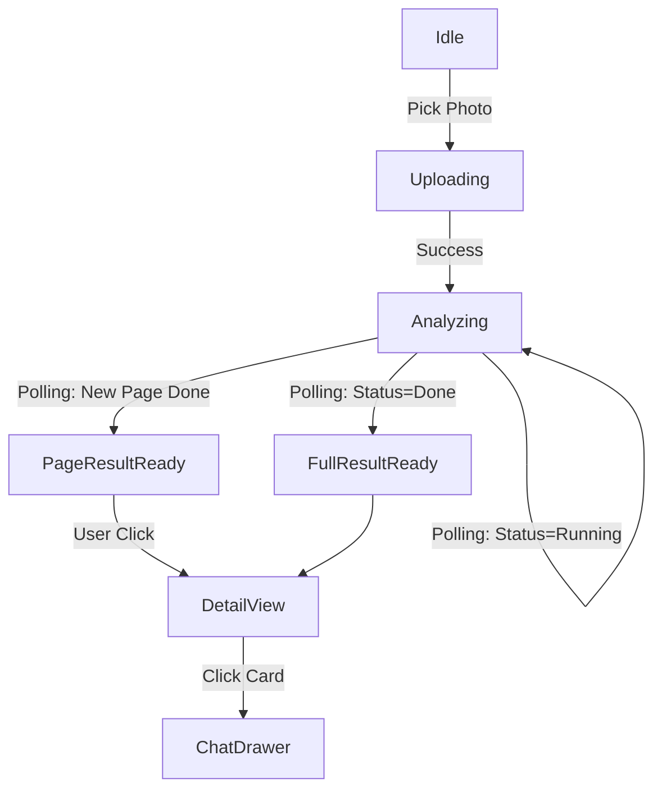

# (Archived) 前端业务逻辑与架构框架（v2.2 口径，已废弃）

> ⚠️ **Deprecated / Historical**  
> 本文档基于当时的 `docs/frontend_design_spec_v2.md` **v2.2** 与早期 Excalidraw 整理，包含已被否决/已变更的设计（例如：强制停留 1.5s、Chat Drawer 等）。  
> **当前前端唯一真源**：`docs/frontend_design_spec_v2.md`（v2.3+，以 `noteacher-UIUX.excalidraw` 为准）。  
> 保留本文仅用于追溯讨论历史，不应作为实现依据。

# 前端业务逻辑与架构框架 (Frontend Architecture & Business Logic)

> 基于 Excalidraw 设计稿与 `frontend_design_spec_v2.md` (v2.2) 整理输出

## 1. 核心业务逻辑体系 (Business Logic System)

### 1.1 "Scan-to-Learn" 主作业链路
这是应用的核心循坏，关键在于通过**渐进式反馈**消除用户的等待焦虑。

*   **输入阶段 (Input Phase)**
    *   **双模式采集**:
        *   `Camera`: 调用原生相机 (`capture="environment"`) 拍摄作业。
        *   `Album`: 从相册选择现有图片。
    *   **极速响应**: 选中文件后立即触发上传，本地生成缩略图覆盖上传间隙 (200ms-1s)。

*   **分析阶段 (Analyzing - The "Looking Glass")**
    *   **状态可视化**: 展示 "Robot Scanning" 动画 (Lottie)，强制停留至少 1.5s 以强化“AI 正在思考”的科技感。
    *   **智能轮询引擎 (Smart Polling Engine)**:
        *   **动态降频**: 遵循 2s → 5s → 10s 的策略，减少服务器压力。
        *   **渐进式披露 (Progressive Disclosure)**:
            *   **Level 1 (占位)**: 收到 `question_cards` 占位符即渲染灰色卡片。
            *   **Level 2 (判定)**: 按**页 (Page)** 为粒度，当一页处理完成，批量翻转该页卡片为 ✅/❌ 状态。
            *   **Level 3 (复核)**: 针对高风险/不确定题目，异步刷新为 Check 态。

*   **结果阶段 (Result Phase)**
    *   **错题驱动视图**: 默认进入 "Mistakes" 列表（左右滑动），聚焦用户关注点；提供 Toggle 切换查看 "All"。
    *   **多页概览**: 顶部展示页码 Tabs，支持在 Page 1 完成时直接查看，同时后台继续处理 Page 2/3。

### 1.2 AI 辅导闭环 (AI Tutoring Loop)
*   **入口**: 错题详情页、结果页卡片。
*   **上下文 (Context)**: 固定携带 `submission_id` + `item_id`，确保 AI 针对特定题目答疑。
*   **回溯能力 (Rehydrate)**: 即使是历史作业，点击“问老师”也能自动恢复或重建会话。
*   **交互形式**: 底部抽屉 (Drawer) 覆盖，支持 LaTeX 公式流式渲染。

### 1.3 历史与数据 (History & Data)
*   **单一事实来源**: 严格依赖 `GET /api/v1/submissions`。
*   **快照查看**: 查看历史作业时不重新触发计算，直接渲染存储的静态结果。

### 1.4 深度分析与数据归档 (Analysis & Archive)
> 补全: 基于 Excalidraw 视觉审查新增

*   **多维报告 (Smart Reports)**:
    *   **Filter**: 支持 Rotary Dial (旋钮) 选择周期/学科，触发聚合计算。
    *   **Metrics**: 展示正确率仪表盘、错题趋势图 (Recharts)、薄弱知识点 Top3。
*   **知识档案 (Data Archive)**:
    *   **结构化**: 按学科 -> 知识点卡片 (Algebra/Geometry) -> 题目列表 分级展示。
    *   **掌握闭环 (Mastery)**: 错题详情提供 "OK (已掌握)" 按钮，点击后题目从待复习池归档至“已掌握”分组，实现学习闭环。

---

## 2. 构建框架 (Engineering Framework)

### 2.1 技术栈选型
*   **Core**: React 18 + Vite (追求极致的 Build 速度与 Hot Reload)
*   **Language**: TypeScript (严格对齐后端 OpenAPI 契约)
*   **UI System**: 
    *   **Tailwind CSS**: 原子化样式，快速实现 Stitch UI。
    *   **Framer Motion**: 负责卡片翻转、Drawer 进出场、Loading 态过渡等精细动画。
    *   **Recharts / Victory**: 用于渲染错题趋势图与正确率分布。
    *   **Lucide React**: 统一图标库。
*   **State Management**:
    *   **Zustand**: 管理全局 UI 瞬时状态（如：当前上传进度、Drawer 开闭、选中的题目 ID）。
    *   **TanStack Query (React Query)**: 管理服务端状态（轮询逻辑、缓存策略、窗口聚焦重校验）。

### 2.2 目录结构 (Feature-First Architecture)

采用**领域驱动**的目录结构，确保高类聚低耦合：

```text
src/
├── features/               # 业务领域模块
│   ├── home/               # 首页 Dashboard
│   ├── upload/             # 预处理、压缩、上传逻辑
│   ├── grading/            # !!! 核心分析页：轮询引擎、动画状态机
│   ├── result/             # !!! 核心结果页：Question Cards 渲染、多页 Tab 管理
│   ├── chat/               # !!! 核心对话：Drawer、消息流、LaTeX 渲染
│   ├── report/             # New! 智能报表：旋钮交互、图表渲染
│   └── archive/            # New! 数据档案：知识点分类、归档操作
│   └── history/            # 错题本与历史报告
├── components/             # 通用组件
│   ├── ui/                 # 基础原子 (Button, Card, Modal - 基于 Design Token)
│   └── layout/             # 页面骨架 (MobileFrame, NavBar)
├── hooks/                  # 全局 Hooks (usePhotoGallery, useHapticFeedback)
├── services/               # API 层 (Axios 实例, 类型定义)
├── store/                  # Zustand Global Stores
└── utils/                  # 工具函数 (ImageProcess, TimeFormat)
```

### 2.3 关键状态机模型 (Grading State Machine)



