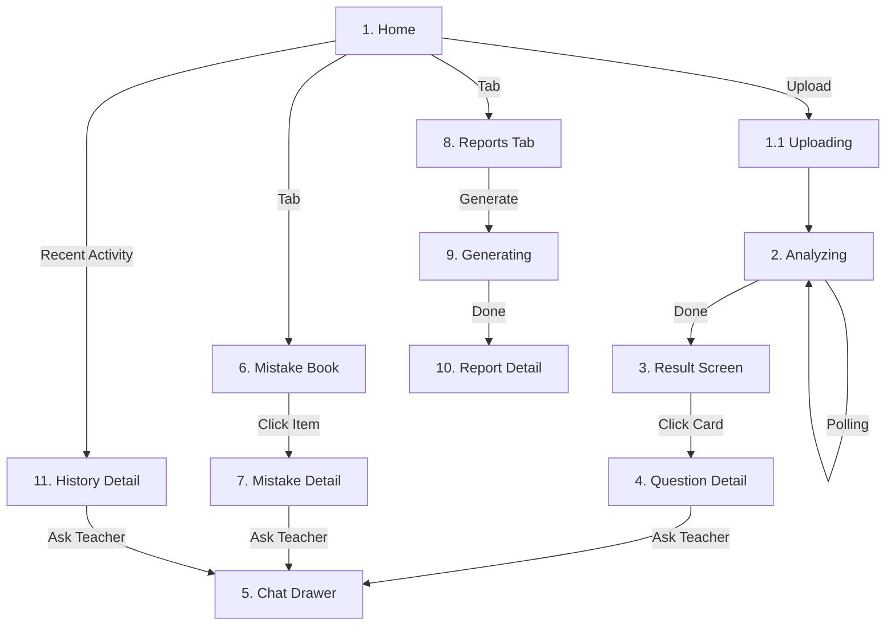

# 前端业务流程与后端对齐规范 (v3.1)

> **Source of Truth**: 基于 Excalidraw 流程图 + 产品确认 + **后端代码实际实现**
> **Last Updated**: 2026-01-11
> **Status**: 待审核

---

## 0. 本文档范围与约定

### 0.1 本文档目的
1. **前端工程师**：明确页面流转、业务逻辑、API 映射
2. **后端工程师**：明确需补充的数据结构、接口
3. **产品经理**：审核业务流程是否符合预期

### 0.2 关键决策记录（产品已确认 2026-01-11）
| 决策项 | 确认结论 |
|--------|----------|
| 分析页"强制 1.5s 停留" | **不做**。实际快则快，仅做防闪屏过渡（<500ms 时加动画） |
| 报告周期选择 | **只做 3天/7天/30天 预设**，不做自定义日期范围 |
| 报告必须分科目 | **是** |
| 旋钮交互 | H5 简化为"点击切换"（点一下转一格） |
| Chat 切片图 | **不再发送**，即使有图题目也只发 OCR 文本+结构化数据 |
| Chat 聚焦策略 | **单题会话**（session_id + submission_id + item_id），不支持跨题 |
| Chat 非本题问询 | 引导用户"到相应题目里问询" |
| Chat 历史记录 | **必须保存**，下次进入可查看+继续问询 |
| 苏格拉底式引导 | **严格**，不给答案，只引导 |

### 0.3 后端代码验证状态
| 模块 | 验证文件 | 状态 |
|------|----------|------|
| Session/QBank | `homework_agent/api/session.py` | ✅ 已核对 |
| Submissions API | `homework_agent/api/submissions.py` | ✅ 已核对 |
| Mistakes API | `homework_agent/api/mistakes.py` | ✅ 已核对 |
| Reports API | `homework_agent/api/reports.py` | ✅ 已核对 |
| Chat API | `homework_agent/api/chat.py` | ✅ 已核对 |
| Grade Worker | `homework_agent/workers/grade_worker.py` | ✅ 已核对 |
| Question Cards | `homework_agent/core/question_cards.py` | ✅ 已核对 |
| Report Features | `homework_agent/services/report_features.py` | ✅ 已核对 |

---

## 1. 信息架构（页面/路由/导航）

### 1.1 全局底部 Tab（4个）

| Tab | 页面名 | 核心功能 |
|-----|--------|----------|
| **Home** | 首页 | 拍照/上传入口 + 最近任务 + 任务进行时（全局可见的 processing 条） |
| **Mistakes** | 错题本 | 错题列表（按日期/科目）→ 错题详情 → 问老师 |
| **Reports** | 报告 | 报告列表/生成入口 → 报告详情（趋势图+建议） |
| **Mine** | 我的 | 用户信息、CP余额、订阅状态（后续）、设置 |

### 1.2 全局 Modal / Stack（覆盖在 Tab 之上）

| 层级 | 组件 | 说明 |
|------|------|------|
| L1 | Camera/Picker | 拍照/选图（H5: `<input capture>` / 相册多选） |
| L2 | Upload Preview | 确认上传/重拍/删除 |
| L3 | Grading Task Detail | 批改过程/结果页（支持多页逐步披露） |
| L4 | Question Detail | 题目详情（有图/无图两套布局） |
| **L5 (最高)** | Chat Drawer | 问老师（**必须 Portal 到最顶层**，解决"弹窗在下层"bug） |

---

## 2. 核心业务对象（前端状态模型）

### 2.1 四大业务对象

```typescript
// 1. Upload（一次上传）
interface Upload {
  upload_id: string;          // = submission_id
  files: File[];
  page_image_urls: string[];
  total_pages: number;
  status: 'uploading' | 'uploaded' | 'failed';
}

// 2. Grade Job（一次批改任务）
interface GradeJob {
  job_id: string;
  status: 'queued' | 'processing' | 'running' | 'done' | 'failed';
  elapsed_ms: number;
  total_pages: number;
  done_pages: number;
  page_summaries: PageSummary[];
  question_cards: QuestionCard[];
}

// 3. Question Card（题目卡片）- 基于 homework_agent/core/question_cards.py
interface QuestionCard {
  item_id: string;              // 格式: "p{page_index+1}:q:{question_number}"
  question_number: string;      // 可为 "N/A"
  page_index: number;           // 0-based
  answer_state: 'has_answer' | 'blank' | 'unknown';  // 注意：后端用 'unknown' 而非 'partial'
  card_state: 'placeholder' | 'verdict_ready' | 'review_pending' | 'review_ready' | 'review_failed';
  verdict?: 'correct' | 'incorrect' | 'uncertain';
  reason?: string;
  needs_review?: boolean;       // verdict=uncertain 时自动为 true
  question_content?: string;    // 最多 20 字符，超出用 "…" 截断
}

// 4. Report（报告）
interface Report {
  report_id: string;
  job_id?: string;
  status: 'queued' | 'pending' | 'running' | 'done' | 'failed';
  window_days: 3 | 7 | 30;
  subject: 'math' | 'english';
  stats: ReportStats;
  content: ReportContent;
}
```

### 2.2 推荐 Store 划分

| Store | 用途 |
|-------|------|
| `TaskStore` | 当前进行中的 job（用于 Home 的"任务进行时"） |
| `SubmissionStore` | 历史 submissions 列表 + 详情（用于 Recent Activity / History） |
| `ChatStore` | 按 `session_id + submission_id + item_id` 管理会话 |
| `ReportStore` | 报告列表 + 生成任务状态 |

---

## 3. 关键链路（页面流转 + API 映射）

### 3.1 链路 A：拍照 → 上传 → 批改

```
┌─────────────┐    ┌─────────────┐    ┌─────────────┐    ┌─────────────┐
│  Home       │ => │  Camera/    │ => │  Upload     │ => │  Analyzing  │
│  (Tap to    │    │  Picker     │    │  Preview    │    │  (Polling)  │
│   start)    │    │             │    │             │    │             │
└─────────────┘    └─────────────┘    └─────────────┘    └─────────────┘
                                            │                   │
                                            ▼                   ▼
                                    POST /api/v1/uploads   POST /api/v1/grade
                                    => upload_id           => job_id
                                                                │
                                                                ▼
                                                    GET /api/v1/jobs/{job_id}
                                                    (轮询直到 done)
```

**API 调用序列**：
1. 选图后 → `POST /api/v1/uploads` → 得到 `upload_id` + `page_image_urls`
2. 立即 → `POST /api/v1/grade` (带 `X-Force-Async: 1`) → 得到 `job_id`
3. 进入 Analyzing → 轮询 `GET /api/v1/jobs/{job_id}`

### 3.2 链路 B：批改结果 → 题目详情 → 问老师

```
┌─────────────┐    ┌─────────────┐    ┌─────────────┐
│  Result     │ => │  Question   │ => │  Chat       │
│  (Cards)    │    │  Detail     │    │  Drawer     │
│             │    │  (有图/无图) │    │  (Portal)   │
└─────────────┘    └─────────────┘    └─────────────┘
      │                                      │
      ▼                                      ▼
 已在 job 响应中             POST /api/v1/chat (SSE)
 包含 question_cards         + submission_id + item_id
```

**结果页展示规则**：
- **默认视图**：错题/存疑/待定（`verdict=incorrect|uncertain` 或 `card_state=review_pending`）
- **可切换**：全部题目视图
- **未作答**：`answer_state=blank` 单独显示为灰色卡，不算错题

### 3.3 链路 C：错题本 → 错题详情 → 问老师

```
┌─────────────┐    ┌─────────────┐    ┌─────────────┐
│  Mistakes   │ => │  Mistake    │ => │  Chat       │
│  Tab        │    │  Detail     │    │  Drawer     │
└─────────────┘    └─────────────┘    └─────────────┘
      │                  │                   │
      ▼                  ▼                   ▼
GET /api/v1/mistakes  已在列表中获取    POST /api/v1/chat
                      + 可调            + submission_id
                      GET /submissions/ + item_id
                      {submission_id}
```

### 3.4 链路 D：历史作业 → 详情 → 问老师（Rehydrate）

```
┌─────────────┐    ┌─────────────┐    ┌─────────────┐
│  Home       │ => │  History    │ => │  Chat       │
│  Recent     │    │  Detail     │    │  (Rehydrate)│
│  Activity   │    │  (快照)     │    │             │
└─────────────┘    └─────────────┘    └─────────────┘
      │                  │                   │
      ▼                  ▼                   ▼
GET /api/v1/       GET /api/v1/        POST /api/v1/chat
submissions        submissions/        + submission_id
                   {submission_id}     + item_id
                                       (后端重建 session)
```

### 3.5 链路 E：报告生成 → 报告详情

```
┌─────────────┐    ┌─────────────┐    ┌─────────────┐    ┌─────────────┐
│  Reports    │ => │  Select     │ => │  Generating │ => │  Report     │
│  Tab        │    │  Period/    │    │  (Polling)  │    │  Detail     │
│             │    │  Subject    │    │             │    │             │
└─────────────┘    └─────────────┘    └─────────────┘    └─────────────┘
      │                  │                   │                   │
      ▼                  ▼                   ▼                   ▼
GET /api/v1/       GET /api/v1/        POST /api/v1/       GET /api/v1/
reports/eligibility reports/eligibility reports             reports/{id}
                   (检查门槛)           => job_id
                                       GET /api/v1/
                                       reports/jobs/{id}
```

**报告周期选项（固定 3 档）**：
- 3 天 (`window_days: 3`)
- 7 天 (`window_days: 7`)
- 30 天 (`window_days: 30`)

---

## 4. 核心页面详细规格

### 4.1 首页 (Home)

**布局**：
```
+-----------------------------------+
|  MathMaster           [Avatar]    |
|                                   |
|      ( Animated AI Logo )         |
|                                   |
|   [      SCAN / UPLOAD      ]     |
|   +-----------------------+       |
|   | [📷 Camera] [🖼️ Album] |     |
|   +-----------------------+       |
|                                   |
| [ 任务进行时 (如果有) ]            |  <-- 全局可见的 processing 条
| | Page 2/3 批改中...        |     |
| +-----------------------------+   |
|                                   |
| [ Recent Activity Card        ]   |
| | 🕒 Today, 10:23             |   |
| | 📚 Math Worksheet (-2)  >   |   |
| +-----------------------------+   |
|                                   |
| [ Home ] [Mistake] [Report] [Me]  |
+-----------------------------------+
```

**逻辑**：
- **任务进行时**：`TaskStore.currentJobId` 存在时显示进度条
- **Recent Activity**：`GET /api/v1/submissions?limit=5`
- **点击 Recent Item**：进入 History Detail（快照渲染）
- **localStorage 记录**：`last_job_id` / `last_submission_id`（刷新后可恢复追更）

### 4.2 批改中 (Analyzing)

**布局**：
```
+-----------------------------------+
|                                   |
|      ( Lottie Animation )         |
|      [ Robot Scanning... ]        |
|                                   |
|     (Dynamic Status Text)         |
|   > "Identifying Questions..."    |
|     "Verifying Answers..."        |
|     "Generating Report..."        |
|                                   |
|  [ Page Progress: 1/3 ● ○ ○ ]     |
|                                   |
|  [ 占位卡预览区 ]                  |
|  +----------------------------+   |
|  | Q1 ⏳ | Q2 ⏳ | Q3 ⏳ |     |  <-- 按页逐步翻转
|  +----------------------------+   |
|                                   |
+-----------------------------------+
```

**轮询策略**（关键规则）：
```typescript
// 轮询频率降频
const POLL_INTERVALS = {
  '0-2min': 2000,   // 每 2 秒
  '2-10min': 5000,  // 每 5 秒
  '10min+': 10000,  // 每 10 秒
};

// 动态最大等待时间
const maxWait = Math.min(30 * 60 * 1000, Math.max(10 * 60 * 1000, totalPages * 6 * 60 * 1000));

// ⚠️ 停止条件（关键！）
const shouldStop = (job: GradeJob) => {
  const isDone = job.status === 'done' || job.status === 'failed';
  const hasNoPending = !job.question_cards?.some(c => c.card_state === 'review_pending');
  return isDone && hasNoPending;  // 两个条件都满足才停止！
};
```

**防闪屏**：如果完成时间 < 500ms，添加过渡动画（不强制 1.5s 停留）

### 4.3 结果页 (Result)

**布局**：
```
+-----------------------------------+
|  < Back   Grading Result          |
|                                   |
|  [ Page Tabs: 1 | 2 | 3       ]   | <-- 多页切换
|                                   |
|  [ View Toggle: Mistakes | All ]  | <-- 默认 Mistakes
|  +----------------------------+   |
|  | +------------------------+ |   |
|  | | Q1 (Wrong ❌)          | |   |
|  | | [ Real Crop Image ]    | |   | <-- 使用 page_image_url + bbox 裁剪
|  | |                        | |   |
|  | | Reason: Calculation... | |   |
|  | | [ Ask Teacher ]        | |   |
|  | +------------------------+ |   |
|  +----------------------------+   |
|                                   |
|  ( Indicator:  •  o  o  o )       |
+-----------------------------------+
```

**卡片状态映射**：
| card_state | verdict | 显示样式 |
|------------|---------|----------|
| placeholder | - | 灰色骨架卡 |
| verdict_ready | correct | ✅ 绿色卡 |
| verdict_ready | incorrect | ❌ 红色卡 |
| verdict_ready | uncertain | ⚠️ 黄色卡 |
| review_pending | - | ⏳ 加载中 |
| review_ready | - | 根据 verdict 显示 |
| review_failed | - | ⚠️ 复核失败 |

**错题/存疑集合规则**：
```typescript
const isMistakeOrPending = (card: QuestionCard) => {
  return card.verdict === 'incorrect' 
      || card.verdict === 'uncertain'
      || card.card_state === 'review_pending'
      || card.card_state === 'review_ready'
      || card.card_state === 'review_failed';
};
// answer_state === 'blank' 不算错题，单独显示
```

### 4.4 题目详情 (Question Detail)

**两套布局**：

#### 有图模式：
```
+-----------------------------------+
|  < Back   Q3                      |
|                                   |
|  [     Full Question Crop      ]  | <-- 使用 slice_image_url 或 page + bbox 裁剪
|  [       (Zoomable)            ]  |
|                                   |
|  Status: ❌ Wrong                 |
|  Knowledge: [Algebra] [Function]  |
|  Error: [Calculation i]           | <-- 错因标签，点 i 展开说明
|                                   |
|  [ Analysis / Reason ]            |
|  "You missed the negative sign.."|
|                                   |
|  +-----------------------------+  |
|  | 💬 问老师 (Floating Button) |  |
|  +-----------------------------+  |
+-----------------------------------+
```

#### 无图模式：
```
+-----------------------------------+
|  < Back   Q3                      |
|                                   |
|  [ OCR 文本（分段显示）]            |
|  "题目：已知 a+b=5, ab=6..."      |
|  "学生作答：x=2"                   |
|                                   |
|  Status: ❌ Wrong                 |
|  Knowledge: [Algebra]             |
|                                   |
|  [ Analysis / Reason ]            |
|  "计算步骤错误..."                 |
|                                   |
|  +-----------------------------+  |
|  | 💬 问老师 (Floating Button) |  |
|  +-----------------------------+  |
+-----------------------------------+
```

### 4.5 Chat Drawer (问老师)

**关键技术约束**：
```typescript
// 1. 必须使用 React Portal 挂载到最顶层
<Portal container={document.body}>
  <ChatDrawer />
</Portal>

// 2. 会话键：submission_id + item_id
const chatKey = `${submissionId}:${itemId}`;

// 3. 请求必须带 context_item_ids
const chatRequest = {
  question: userInput,
  subject: 'math',
  session_id: sessionId,           // 可选，后端可重建
  submission_id: submissionId,     // 必需
  context_item_ids: [itemId],      // 必需！确保只引用该题
  history: previousMessages,
};
```

**Chat 行为规则**：
1. **只基于当前题目**：不发切片图，只发 OCR 文本 + 结构化数据
2. **非本题问询**：回复"请到相应的题目里问询"
3. **历史记录保存**：每道题的聊天记录独立保存，下次进入可查看+继续
4. **苏格拉底式引导**：**严格不给答案**，只引导思考

### 4.6 报告页 (Reports)

**布局**：
```
+-----------------------------------+
|  Study Report                     |
|                                   |
|  [ 周期选择（点击切换旋钮样式）]     |
|  +-----------------------------+  |
|  |    ⟲                        |  |
|  |  [3天]  7天   30天          |  | <-- 点一下转一格
|  +-----------------------------+  |
|                                   |
|  [ 科目选择 ]                      |
|  [ Math ▼ ]                       |
|                                   |
|  [ 解锁状态提示 ]                  |
|  "还需 1 次提交即可生成报告"        |
|                                   |
|  [ Generate Report Button ]       | <-- 未解锁时置灰
+-----------------------------------+
```

**报告详情**：
```
+-----------------------------------+
|  < Back   学情报告 (1/3-1/10)     |
|                                   |
|  [ 正确率仪表盘 ]                  |
|  +-----------------------------+  |
|  |      85%                    |  |
|  |    ████████░░               |  |
|  +-----------------------------+  |
|                                   |
|  [ 知识点薄弱 Top5 趋势图 ]        | <-- ⚠️ 需后端补齐
|  +-----------------------------+  |
|  |    /\    /\                 |  |
|  |   /  \  /  \    代数        |  |
|  |  /    \/    \   几何        |  |
|  +-----------------------------+  |
|                                   |
|  [ 错因分布 Top3 趋势图 ]          | <-- ⚠️ 需后端补齐
|  +-----------------------------+  |
|  |  计算错误: ████████ 45%     |  |
|  |  概念混淆: ████░░░░ 30%     |  |
|  |  审题不清: ███░░░░░ 25%     |  |
|  +-----------------------------+  |
|                                   |
|  [ 温暖建议 ]                      |
|  "继续保持！本周几何有进步..."      |
+-----------------------------------+
```

---

## 5. API 端点映射表

### 5.1 已实现（可直接使用）- 基于后端代码核对

| 端点 | 方法 | 用途 | 前端页面 | 验证状态 |
|------|------|------|----------|----------|
| `/api/v1/uploads` | POST | 上传图片 | Upload Preview | ✅ `api/upload.py` |
| `/api/v1/grade` | POST | 创建批改任务 | Analyzing | ✅ `api/grade.py` |
| `/api/v1/jobs/{job_id}` | GET | 查询任务状态 | Analyzing | ✅ `api/session.py:293` |
| `/api/v1/submissions` | GET | 历史作业列表 | Home Recent, History | ✅ `api/submissions.py:119` |
| `/api/v1/submissions/{id}` | GET | 作业详情快照 | History Detail | ✅ `api/submissions.py:198` |
| `/api/v1/chat` | POST | 辅导对话 (SSE) | Chat Drawer | ✅ `api/chat.py` |
| `/api/v1/mistakes` | GET | 错题列表 | Mistakes Tab | ✅ `api/mistakes.py:47` |
| `/api/v1/mistakes/stats` | GET | 错题统计 | Mistakes Tab | ✅ `api/mistakes.py:92` |
| `/api/v1/mistakes/exclusions` | POST | 排除错题 | Mistakes Tab | ✅ `api/mistakes.py:121` |
| `/api/v1/mistakes/exclusions/{sid}/{iid}` | DELETE | 恢复错题 | Mistakes Tab | ✅ `api/mistakes.py:145` |
| `/api/v1/reports/eligibility` | GET | 报告解锁条件 | Reports Tab | ✅ `api/reports.py:200` |
| `/api/v1/reports` | POST | 创建报告任务 | Reports Tab | ✅ `api/reports.py:122` |
| `/api/v1/reports` | GET | 报告列表 | Reports Tab | ✅ `api/reports.py:303` |
| `/api/v1/reports/jobs/{id}` | GET | 报告任务状态 | Reports Tab | ✅ `api/reports.py:167` |
| `/api/v1/reports/{id}` | GET | 报告详情 | Report Detail | ✅ `api/reports.py:269` |
| `/api/v1/session/{sid}/qbank` | GET | 调试：查看 qbank 元数据 | Debug | ✅ `api/session.py:303` |
| `/api/v1/session/{sid}/progress` | GET | 调试：查看批改进度 | Debug | ✅ `api/session.py:347` |

### 5.2 后端需补充/调整（基于代码审计）

| 需求 | 优先级 | 现状分析 | 建议方案 |
|------|--------|----------|----------|
| **Chat 历史记录持久化** | P0 | 当前 session 存 InMemory/Redis，TTL=24h（`SESSION_TTL_SECONDS`），会话级历史存在 `session_data.history` 但不持久化到 DB | 新增 `chat_histories` 表，按 `user_id + submission_id + item_id` 持久化 |
| **Chat 单题聚焦校验** | P0 | 当前 `context_item_ids` 只用于注入上下文，未强制拒绝非本题问询 | 在 `_prepare_chat_context_or_abort` 中增加校验逻辑 |
| **报告趋势数据** | P1 | `report_features.py` 已有 `knowledge_mastery.rows` 和 `process_diagnosis`，但**无时序分桶** | 新增 `compute_trend_features()` 函数 |
| **错因分类扩展** | P1 | `Severity` 枚举只有 `calculation/concept/format/unknown/medium/minor`（`schemas.py:18-25`） | 扩展枚举或新增 `diagnosis_code` 字段 |
| **趋势图防爆规则** | P1 | 未实现分桶聚合 | 在 `report_worker.py` 中添加 `>15` 时按 3 天分桶逻辑 |

---

## 6. 后端需补充的数据结构（基于代码审计详细规格）

### 6.1 Chat 历史记录持久化（P0）

**现状**（`api/session.py`）：
- Session 存储在 cache（InMemory/Redis），TTL=24h
- `session_data.history` 包含对话历史，但仅限当前 session
- Session 过期后历史丢失

**需求**：每道题的聊天记录需持久化，支持下次进入查看+继续

**建议方案**：

```sql
-- 新表 chat_histories
CREATE TABLE chat_histories (
  id UUID PRIMARY KEY DEFAULT uuid_generate_v4(),
  user_id TEXT NOT NULL,
  submission_id TEXT NOT NULL,
  item_id TEXT NOT NULL,
  messages JSONB NOT NULL DEFAULT '[]',
  created_at TIMESTAMPTZ DEFAULT NOW(),
  updated_at TIMESTAMPTZ DEFAULT NOW(),
  UNIQUE (user_id, submission_id, item_id)
);

CREATE INDEX idx_chat_histories_lookup ON chat_histories(user_id, submission_id, item_id);
```

```python
# 新增 API 端点
# GET /api/v1/chat/history?submission_id=xxx&item_id=yyy
@router.get("/chat/history")
def get_chat_history(
    submission_id: str,
    item_id: str,
    authorization: Optional[str] = Header(default=None),
    x_user_id: Optional[str] = Header(default=None, alias="X-User-Id"),
):
    user_id = require_user_id(authorization=authorization, x_user_id=x_user_id)
    # 从 chat_histories 表查询
    ...
```

### 6.2 Chat 单题聚焦校验（P0）

**现状**（`api/chat.py:_prepare_chat_context_or_abort`）：
- `context_item_ids` 用于注入错题上下文到 LLM prompt
- 未校验用户是否在问其他题目

**需求**：用户问非当前 `item_id` 的题目时，返回引导消息

**建议方案**：

```python
# 在 _prepare_chat_context_or_abort 中添加
def _check_question_scope(
    user_message: str,
    context_item_ids: List[str],
    qbank: Dict[str, Any],
) -> Optional[str]:
    """
    检测用户是否在问其他题目。
    返回 None 表示通过，返回字符串表示需要引导用户。
    """
    # 使用现有的 _select_question_number_from_text 检测
    available_qnums = list(qbank.get("questions", {}).keys())
    detected, match_type = _select_question_number_from_text(
        user_message, available_qnums
    )
    
    if detected and match_type != "none":
        # 检查是否在 context_item_ids 对应的题目范围内
        focus_qnums = [...]  # 从 context_item_ids 提取
        if detected not in focus_qnums:
            return f"你问的是第 {detected} 题，请到那道题的详情页点击「问老师」来询问。"
    return None
```

### 6.3 报告趋势数据（P1）

**现状**（`services/report_features.py`）：
- `knowledge_mastery.rows` 提供按知识点的正确率统计
- `process_diagnosis.severity_counts` 提供错因分布
- **无时间序列分桶**

**需求**：报告详情页需要两张趋势图（知识点 Top5 + 错因 Top3）

**建议方案**：

```python
# 在 report_features.py 中新增
def compute_trend_features(
    *,
    attempts: List[Dict[str, Any]],
    window: Dict[str, Any],
    max_points: int = 15,
) -> Dict[str, Any]:
    """
    计算趋势数据，超过 max_points 时按 3 天分桶。
    """
    # 按 submission 或按日期分组
    submissions = _group_by_submission(attempts)
    
    if len(submissions) <= max_points:
        # 按单次 submission 输出
        granularity = "submission"
        buckets = submissions
    else:
        # 按 3 天分桶
        granularity = "bucket_3d"
        buckets = _bucket_by_3_days(attempts)
    
    # 计算 Top5 知识点趋势
    knowledge_trends = _compute_knowledge_trends(buckets, top_n=5)
    
    # 计算 Top3 错因趋势
    cause_trends = _compute_cause_trends(buckets, top_n=3)
    
    return {
        "granularity": granularity,
        "knowledge_trends_top5": knowledge_trends,
        "cause_trends_top3": cause_trends,
    }
```

**返回数据格式**：
```typescript
interface TrendFeatures {
  granularity: 'submission' | 'bucket_3d';
  knowledge_trends_top5: KnowledgeTrend[];
  cause_trends_top3: CauseTrend[];
}

interface KnowledgeTrend {
  bucket_start: string;  // ISO date
  bucket_end: string;
  tag: string;           // 知识点名称
  wrong_count: number;
  total_count: number;
  accuracy?: number;
}

interface CauseTrend {
  bucket_start: string;
  bucket_end: string;
  cause: string;         // 错因分类
  count: number;
}
```

### 6.4 错因分类扩展（P1）

**现状**（`models/schemas.py:18-25`）：
```python
class Severity(str, Enum):
    CALCULATION = "calculation"
    CONCEPT = "concept"
    FORMAT = "format"
    UNKNOWN = "unknown"
    MEDIUM = "medium"
    MINOR = "minor"
```

**需求**：更细粒度的错因分类

**建议方案**（不破坏现有字段，新增 `diagnosis_code`）：

```python
class DiagnosisCode(str, Enum):
    CALCULATION_ERROR = "calculation_error"      # 计算错误
    CONCEPT_CONFUSION = "concept_confusion"      # 概念混淆
    CARELESS_READING = "careless_reading"        # 审题不清
    STEP_MISSING = "step_missing"                # 步骤遗漏
    FORMULA_WRONG = "formula_wrong"              # 公式错误
    UNIT_MISSING = "unit_missing"                # 单位遗漏
    SIGN_ERROR = "sign_error"                    # 符号错误
    OTHER = "other"

# 在 WrongItem/MathStep 中新增可选字段
diagnosis_codes: Optional[List[DiagnosisCode]] = Field(
    default=None,
    description="细粒度错因诊断码列表"
)
```

---

## 7. 前端实现框架建议

### 7.1 技术栈

| 层级 | 选型 | 说明 |
|------|------|------|
| Core | React 18 + Vite | 快速构建 + HMR |
| Language | TypeScript | 严格类型对齐后端 |
| Styling | Tailwind CSS | 原子化样式 |
| Animation | Framer Motion | 卡片翻转、Drawer 动效 |
| State | Zustand + React Query | 瞬时状态 + 服务端状态 |
| Charts | Recharts / Victory | 趋势图渲染 |
| Icons | Lucide React | 统一图标库 |

### 7.2 目录结构

```
src/
├── features/               # 业务领域模块
│   ├── home/               # 首页 Dashboard
│   ├── upload/             # 预处理、压缩、上传逻辑
│   ├── grading/            # 核心分析页：轮询引擎、动画状态机
│   ├── result/             # 核心结果页：Question Cards 渲染
│   ├── chat/               # 核心对话：Drawer、消息流、LaTeX
│   ├── mistakes/           # 错题本
│   ├── reports/            # 报表：周期选择、图表渲染
│   └── settings/           # 设置页
├── components/             # 通用组件
│   ├── ui/                 # 基础原子 (Button, Card, Modal)
│   └── layout/             # 页面骨架 (MobileFrame, NavBar)
├── hooks/                  # 全局 Hooks
│   ├── usePolling.ts       # 轮询引擎
│   ├── useLocalStorage.ts  # 持久化
│   └── useSSE.ts           # SSE 解析
├── services/               # API 层
│   ├── api.ts              # Axios 实例
│   └── types.ts            # 类型定义
├── store/                  # Zustand Stores
│   ├── taskStore.ts
│   ├── submissionStore.ts
│   ├── chatStore.ts
│   └── reportStore.ts
└── utils/                  # 工具函数
    ├── imageProcess.ts     # 图片压缩、裁剪
    └── timeFormat.ts       # 时间格式化
```

### 7.3 关键 Hook 设计

```typescript
// usePolling.ts - 轮询引擎
function usePolling<T>({
  fetcher: () => Promise<T>,
  shouldStop: (data: T) => boolean,
  intervalStrategy: (elapsed: number) => number,
  maxDuration: number,
  onUpdate?: (data: T) => void,
}) {
  // 实现动态降频、超时不报错、可恢复
}

// useSSE.ts - SSE 解析（POST + SSE 响应）
function useSSE({
  url: string,
  body: any,
  onEvent: (event: string, data: any) => void,
  onError?: (error: Error) => void,
}) {
  // 使用 fetch + ReadableStream 解析
  // 不能用 EventSource（只支持 GET）
}
```

---

## 8. 验收清单 (Definition of Done)

### 8.1 轮询逻辑
- [ ] 3 页作业在 10-20 分钟区间：前端不得进入错误页
- [ ] 轮询频率按阶段降频（2s → 5s → 10s）
- [ ] 计时展示使用后端 `elapsed_ms`（避免后台 Tab 降频误判）
- [ ] **停止条件必须同时满足**：`status=done/failed` AND `无 review_pending 卡`

### 8.2 渐进披露
- [ ] 新页出现占位卡时 ≤ 1 次轮询内可见
- [ ] 页完成时卡片批量翻转为判定态
- [ ] 卡片列表使用 `item_id` 作为 key（避免闪屏）

### 8.3 Chat 行为
- [ ] Chat Drawer 使用 Portal 到最顶层（z-index 最高）
- [ ] 请求必须带 `submission_id` + `context_item_ids`
- [ ] 历史记录可查看+继续（刷新不丢失）
- [ ] 非本题问询时返回引导消息

### 8.4 报告功能
- [ ] 周期只支持 3天/7天/30天
- [ ] 必须选择科目
- [ ] 解锁门槛检查 (`GET /eligibility`)
- [ ] 趋势图正确渲染（待后端补齐数据）

---

## 9. 附录：页面流转图 (Mermaid)



---

**文档版本**: v3.1  
**最后更新**: 2026-01-11  
**状态**: 待审核
