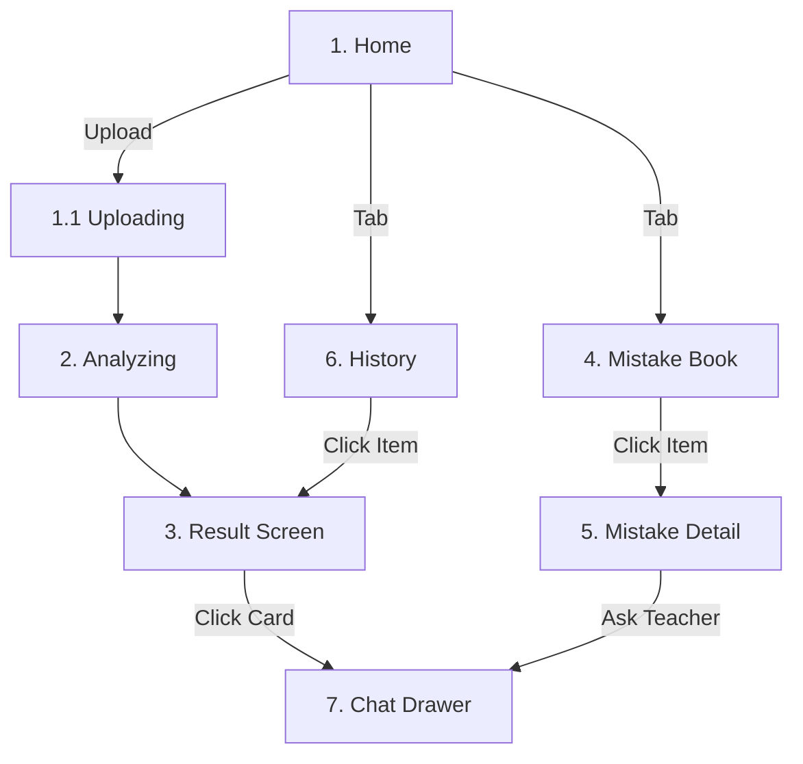

# Frontend Development Specification (v2.2)
**Source of Truth for "Homework Master" Frontend Engineering**
**Last Updated**: 2026-01-04

此文档作为前端开发的**唯一真理来源**，已整合 Stitch UI 设计稿与后端工程师的可行性反馈。**v2.2 版本明确了“分阶段落地”策略**，优先保证核心链路的商业化体验。

## 0. 口径对齐（避免“外部总结”误导协作）

外部《项目全面体检报告》里有部分表述与当前代码不一致（例如 SSE 客户端实现、端点数量、类型 “no any” 结论）。已完成代码核对并统一口径：

- 代码核对报告：`docs/reports/healthcheck_report_code_alignment_20260103.md`
- 需要前端牢记的三点：
  - **Chat SSE 客户端**：本项目 `/api/v1/chat` 是 **POST + SSE 响应**；demo 前端用 `fetch + ReadableStream` 解析 SSE（不是 EventSource）。
  - **断线续接**：后端支持 `Last-Event-Id`（恢复 session + 最多重放 3 条 assistant），但当前前端未接入该 header（未来可补，不影响验收主链路）。
  - **类型“全绿”不是现状**：核心链路 types 已对齐，但仍存在少量 `any`/类型逃逸（计划在稳定后清债）。

---

## 0.1 当前联调验收状态（P0/P1）

> 说明：此处仅记录“是否已跑通/可验收”，不锁死最终 UI（Stitch 视觉改版后会再调整组件与交互）。

- ✅ Upload/Grade 主链路：`POST /api/v1/uploads` → `POST /api/v1/grade`（前端固定 `X-Force-Async: 1`）→ `GET /api/v1/jobs/{job_id}` 轮询
- ✅ 多图上传：`<input multiple>` + multipart `file` 循环 `append`
- ✅ 稳健轮询：动态最大等待时间 + 降频；停止条件为 `(done/failed) AND (无 review_pending 卡)`
- ✅ Layer 3 复核卡可验收：`review_pending → review_ready/review_failed` 可在前端稳定观察
- ✅ History/Recent Activity：`GET /api/v1/submissions`（权威数据源，不依赖 `/mistakes`）
- ✅ History Detail（方案 B）：`GET /api/v1/submissions/{submission_id}`（快照详情秒开）
- ✅ 历史错题问老师（Rehydrate）：`POST /api/v1/chat` 支持 `submission_id + context_item_ids`（无需重新上传）
- ✅ Report 解锁口径：`GET /api/v1/reports/eligibility`（基于 submissions，不会漏掉全对作业）

## I. 全链路交互线稿 (Full-Link Wireframes)

### 1. 首页 (Home Screen)
**场景**: 用户冷启动或回到首页。

```text
+-----------------------------------+
|  MathMaster           [Avatar]    |
|                                   |
|      ( Animated AI Logo )         |
|                                   |
|   [      SCAN / UPLOAD      ]     |
|   +-----------------------+       |
|   | [📷 Camera] [🖼️ Album] |     | <-- 底部核心操作区
|   +-----------------------+       |
|                                   |
| [ Recent Activity Card        ]   |
| | 🕒 Today, 10:23             |   |
| | 📚 Math Worksheet (-2)  >   |   |
| +-----------------------------+   |
|                                   |
| [ Home ] [Mistake] [Report] [Me]  |
+-----------------------------------+
```
**🔗 逻辑**:
*   **(A) Dual Input (Phase 1: Native)**:
    *   **Camera**: 调用 `<input type="file" capture="environment" accept="image/*">`。
        *   *Decision*: 暂不使用 `getUserMedia` 做自定义取景框 (Phase 2)，优先保证兼容性与开发效率。
    *   **Album**: 调用 `<input type="file" accept="image/*">`。
    *   **Trigger**: 文件选中后立即触发 `POST /api/v1/uploads` -> `POST /api/v1/grade` (Scheme A: `images: []`)。
### 1.1 过渡态：上传中 (Transition: Uploading)
**场景**: 选图后，图片正在发送给服务器，但分析尚未开始。
**Stitch UI 参考**: `图片上传中页面`
**目的**: 填补“点击”到“分析界面”之间的 200ms-1s 空白，避免界面僵死。

```text
+-----------------------------------+
|  (Overlay or Full Screen)         |
|                                   |
|        [ Thumbnail ]              |
|      (Spinner/Progress)           |
|                                   |
|    "Uploading Image (45%)..."     |
|                                   |
+-----------------------------------+
```
**🔗 逻辑**:
*   显示本地预览图 (Thumbnail)。
*   进度条或 Spinner 提示上传。
*   上传完毕收到 response 后，平滑跳转至 "Analyzing"。

### 1.2 历史作业入口 (Entrance 2: History)
**场景**: 首页点击 "Recent Activity" 或底部 [Report] -> History List。
**Stitch UI 参考**: `报告 根页面` (History Section)
**Backend**: `GET /api/v1/submissions` 已实现（History List 数据源；不得用 `/mistakes` 推断）。

```text
+-----------------------------------+
|  HISTORY                          |
|                                   |
|  [ Search / Filter ]              |
|  +-----------------------------+  |
|  | 📄 Jan 05 - Math Worksheet  |  |
|  | Score: S  Mistakes: 2       |  |
|  | [ View > ]                  |  |
|  +-----------------------------+  |
|  | 📄 Jan 04 - English         |  |
|  | ...                         |  |
|  +-----------------------------+  |
+-----------------------------------+
```
**🔗 逻辑（已定，方案 B：快照详情）**:
*   点击 Item -> 进入“作业详情（History Detail）”，从后端读取快照渲染，不重建 job：
    *   `GET /api/v1/submissions/{submission_id}`
    *   使用返回的 `question_cards/page_summaries/session_id` 直接展示卡片与辅导入口
*   备注：旧作业若 `session_id` 失效，点击“问老师”走 **Chat Rehydrate**（`POST /api/v1/chat` 带 `submission_id`）。


### 2. 批改中 (Analyzing State)
**场景**: 图片已上传，AI 正在分析。
**目的**: 提供确定感，**强制停留**以展示科技感动效。

```text
+-----------------------------------+
|                                   |
|      ( Lottie Animation )         |
|      [ Robot Scanning... ]        |
|                                   |
|     (Dynamic Status Text)         |
|   > "Identifying Questions..."    |
|     "Verifying Answers..."        |
|     "Generating Report..."        |
|                                   |
+-----------------------------------+
```
**🔗 逻辑**:
*   **Min-Display Time**: 强制展示至少 **1.5s**。
*   **Smooth Exit**: 状态完成后，内容淡出，结果页淡入。
*   **Polling（长任务不“报错卡死”）**:
    *   **轮询超时不等于失败**：不得因为超过固定时长就进入错误页；仍应持续追更，直到后端 `job.status=done/failed`。
    *   **不新增“超时分支按钮”**：UI 始终保持同一条主流程（卡片逐步出现就是确定感），不弹“作业较多/继续等待/返回”等额外分支按钮。
    *   **动态最大等待时间**：`max_wait = min(30min, max(10min, total_pages * 6min))`（例：3 页至少 18min）。
    *   **计时基准**：优先使用后端返回的 `elapsed_ms`（避免浏览器后台 Tab 降频导致前端 wall time 虚高）。
    *   **降频轮询**：
        *   0–2min：每 2s
        *   2–10min：每 5s
        *   10min+：每 10s
    *   **可恢复（建议）**：持久化 `job_id`（localStorage），刷新/跳转后可继续追更（入口可后续放在 Home 的 Recent/Continue）。

### 3. 结果页 (Result Screen)
**场景**: 批改完成，用户查看本次作业概览。
**Stitch UI 参考**: `批改结果 全量完成页面`

```text
+-----------------------------------+
|  < Back   Grading Result          |
|                                   |
|  [ Page Tabs: 1 | 2 | 3       ]   | <-- 多页切换
|                                   |
|  [ View Toggle: Mistakes | All ]  | <-- 默认 Mistakes
|  +----------------------------+   |
|  | +------------------------+ |   |
|  | | Q1 (Wrong ❌)          | |   |
|  | | [ Real Crop Image ]    | |   |
|  | |                        | |   |
|  | | Reason: Calculation... | |   |
|  | | [ Ask Teacher ]        | |   |
|  | +------------------------+ |   |
|  +----------------------------+   |
|                                   |
|  ( Indicator:  •  o  o  o )       |
+-----------------------------------+
```
**🔗 逻辑**:
*   **Default View**: 默认展示 `Mistakes` (错题/存疑/Pending)，减少用户认知负担。提供 Toggle 切换看 `All`。
*   **Progressive Toast**: 当 `page_placeholders_ready` 或新题出现时，弹出 Toast "第 2 页已开始分析..." 并自动定位。
*   **Image Visualization**: 前端利用 `page_image_url` + `bbox` 实时裁剪。
*   **多页渐进披露（逐页出现，不必等全量完成）**:
    *   **顶部进度条/页签（你提的 UI 方向）**：显示 `Page 1/3, 2/3, 3/3`，并可附每页摘要（错题/不确定/未作答）。
    *   **左侧页条（你提的 UI 方向）**：每页一个节点；当新页出现占位卡时立刻高亮，让用户感知“第二页/第三页出来了”。
    *   **每页占位卡预览（关键体验）**：
        *   当后端产出该页占位卡（`page_placeholders_ready`）时，该页区域展示 **2–3 张占位卡**（题号 + 题干前 10–20 字）。
        *   当该页完成（`page_done`）时，该页占位卡批量翻转为判定卡（对/错/不确定/空题）。
*   **错题优先视图（减少认知负担）**:
    *   建议默认显示“错题/存疑卡”列表（左右滑动 Q1/Q2/…），再可切到“全部题卡”。
    *   “错题/存疑卡”集合规则（确定性）：
        *   包含：`verdict=incorrect`、`verdict=uncertain`、`card_state in {review_pending, review_ready, review_failed}`
        *   `answer_state=blank`（未作答）默认不算错题，可单独显示为灰色卡或在底部提示数量
    *   点错题卡 → 打开 Chat Drawer（请求必须带 `context_item_ids=[item_id]`，确保只引用该题证据）。

### 4. 错题本列表 (Mistake Book)
**场景**: 点击底部 [Mistake] Tab，浏览历史错题聚合。

```text
+-----------------------------------+
|  Mistake Book                 [🔍]|
|  [ All ] [ Math ] [ English ]     |
|                                   |
|  Today                            |
|  +-----------------------------+  |
|  | ❌ Q3: Algebra              |  |
|  | [ Crop Thumb ]  "x^2+..."   |  |
|  | [ Review > ]                |  |
|  +-----------------------------+  |
|  | ❌ Q5: Geometry             |  |
|  | [ Crop Thumb ]  "Angle A.." |  |
|  | [ Review > ]                |  |
|  +-----------------------------+  |
|                                   |
|  Yesterday                        |
|  ...                              |
+-----------------------------------+
```
**🔗 逻辑**:
*   列表项点击后弹出 **Mistake Detail Modal**。

### 5. 错题详情 (Mistake Detail Modal)
**场景**: 从错题本点击某一项，查看详细解析。

```text
+-----------------------------------+
|  (Modal / Popup)               X  |
|                                   |
|  [     Full Question Crop      ]  |
|  [       (Zoomable)            ]  |
|                                   |
|  Status: ❌ Wrong                 |
|  Knowledge: [Algebra] [Function]  |
|                                   |
|  [ Analysis / Reason ]            |
|  "You missed the negative sign.." |
|                                   |
|  +-----------------------------+  |
|  | 💬 Ask Teacher (Floating)   |  |
|  +-----------------------------+  |
+-----------------------------------+
```
**🔗 逻辑**:
*   这是 Chat 的主要入口之一。
*   需透出 `submission_id` 和 `item_id` 供 Chat 上下文使用。

### 6. 报告与统计 (Reports & History)
**场景**: 点击底部 [Report] Tab。
**Stitch UI 参考**: `报告 帅选页面`, `报告 根页面`
**Decision (Phase 1)**: 暂不做自由日期范围 `start_date/end_date`（不阻塞 Stitch 主链路）。

```text
+-----------------------------------+
|  Study Report                     |
|                                   |
|  [ Date Picker: Last 7 Days v ]   | <-- Phase 1: 预设窗口（7/30/90），映射到 window_days
|  [ Subject: Math v            ]   |
|                                   |
|  [ Weekly Trend Chart ]           |
|  |  / \  /                    |   |
|  +----------------------------+   |
|                                   |
|  [ Generate Report Button ]       |
+-----------------------------------+
```
**🔗 逻辑**:
*   **解锁门槛**：前端调用 `GET /api/v1/reports/eligibility` 决定是否可生成报告（不足则置灰提示）。
*   **日期选择器（Phase 1）**：先支持 7/30/90 等预设窗口（`window_days`），不做任意日期范围。
*   **生成按钮**：
    *   Demo：优先生成“本次作业报告”（`submission_id` 模式）。
    *   产品：生成周期报告（`window_days` 模式）。
*   自由日期范围（Phase 2/3）：需要后端支持 `start_date/end_date` 后再启用。

### 7. 我的 (Me / Settings)
**场景**: 点击底部 [Me] Tab。
**Stitch UI 参考**: `「我的」 页面`
**Gap**: No Backend Auth/User Profile APIs. Static Implementation Only.

```text
+-----------------------------------+
|  My Profile                       |
|  [ Avatar ]  Test User            |
|                                   |
|  [ 🌍 Language: English/中文 ]    |
|  [ 🔒 Privacy Policy        ]     |
|  [ ℹ️ About Us              ]     |
|  [ 👤 Account Mgmt (Mock)   ]     |
+-----------------------------------+
```

### 8. 对话与辅导 (Chat Drawer)
**场景**: 从结果页或错题详情页点击 "Ask Teacher"。

```text
+-----------------------------------+
|  (Drawer overlays EVERYTHING)  X  | <-- Layering: Z-Index Highest
|                                   |
|  AI Tutor (Context: Q3)           |
|                                   |
|  (Persistent History Area)        |
|  User: 这一步为什么是 -1?          |
|  AI: 移项变号规则...               |
|      $$ a + b = 0 \to a = -b $$   | <-- LaTeX Rendered
|                                   |
|  [ Input...            ] [Send]   |
+-----------------------------------+
```
**技术约束 (Technical Constraints)**:
*   **Persistence**: 按 `submission_id` + `item_id` 双键缓存历史。
*   **Session Strategy**: 
    *   新作业：使用当前 `session_id`。
    *   历史作业（Rehydrate）：通过 `submission_id + item_id` 向后端请求恢复会话。
*   **Layering**: 使用 React Portal 挂载到 body，确保覆盖 Modal。

---

## II. 关键页面流转图 (Page Flow)



这份文档补全了过渡态、错题管理与历史记录的完整视图，供设计师进行全案设计。

---

## III. 验收要点（DoD，便于联调）

### 1) Polling（多页长任务不“卡死”）
- 3 页作业在 10–20 分钟区间：前端不得进入错误页；必须持续展示进度并持续更新卡片。
- 轮询频率按阶段降频（2s→5s→10s），但卡片更新不丢失。
- 计时展示使用后端 `elapsed_ms`（避免后台 Tab 降频造成 UI 误判）。

### 2) 多页渐进披露（用户可感知“新页出现”）
- 任意新页出现占位卡（`page_placeholders_ready` 或 “该页 cards 从 0→>0”）后，≤1 次轮询内必须可见该页 **2–3 张占位卡预览**。
- 任意一页 `page_done` 后，≤1 次轮询内该页卡片进入判定态（对/错/不确定/未作答）并更新页摘要。

### 3) 错题/存疑优先视图（减少认知负担）
- 默认可直接看到“错题/存疑卡”（左右滑动），并可切换到“全部题卡”。
- 点错题卡进入 Chat Drawer 时，请求必须带 `context_item_ids=[item_id]`。

---

## IV. Backend Gaps（已确认需补充 / 以 `implementation_plan_backend_gaps.md` 为准）

- P0：History/Submissions List：`GET /api/v1/submissions`（支撑 Home Recent Activity + History 列表；不能用 `/mistakes` 推断）
- P0：Chat Rehydrate（A‑8 / WL‑P0‑013）：历史 submission 也能“问老师”，不要求重传
- P2：Reports 自由日期范围 `start_date/end_date`（暂缓，不阻塞 Stitch 主链路；Phase 1 用 `window_days` 预设窗口 + `submission_id` 单次报告）

---

## V. 品质增强（非阻塞 / 可选）

> 目标：在不改变后端口径、不引入新依赖风险的前提下，让 UI 更“高级感/简洁感/可用感”。
>
> 对应可执行清单：`homework_frontend/frontend_ui_ux_tasks.md`（P2）。

### 1) Skeleton Loading（推荐）

- History/Mistakes/Reports 列表加载：用骨架屏替代 spinner，减少“空白焦虑”。
- 原则：不影响数据口径；只提升体感。

### 2) 转场与微交互（可选）

- 页面切换：轻量 Push/Pop（可选 Framer Motion；也可只用 CSS transition）。
- 按钮/卡片点击：active 态缩放回弹（scale down → back），提升“触感”。
- Drawer/Modal：进入/退出动效统一（避免突兀闪现）。
