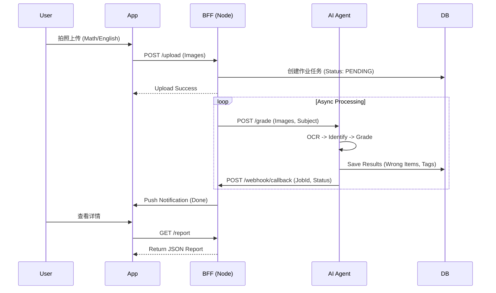
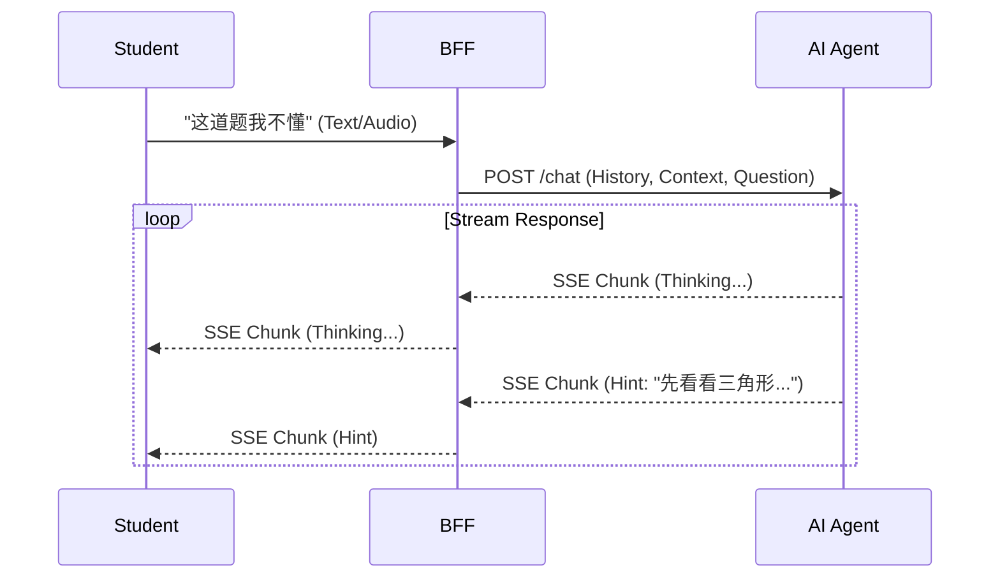

# System Architecture Design

## 1. 架构总览 (Architecture Overview)

采用 **"Dual-Engine" (双引擎)** 架构，结合 Node.js 的高并发 IO 能力与 Python 的 AI 生态优势。

```mermaid
graph TD
    subgraph Client [Client Side: iOS / Android / Harmony]
        App[Mobile App]
    end

    subgraph Cloud [Cloud Infrastructure]
        subgraph BFF [Application Layer - Node.js]
            Gateway[API Gateway / BFF]
            Auth[Auth Service]
            Biz[Business Logic]
        end

        subgraph AI [Core AI Layer - Python]
            Agent[Agent Service (FastAPI)]
            Planner[ReAct Planner]
            Tools[Tool Set: OCR/Search/Math]
        end

        subgraph Data [Data Persistence]
            DB_Biz[(PostgreSQL: User/Biz Data)]
            DB_Vec[(Vector DB: Knowledge Base)]
            OSS[Object Storage (Images)]
        end
    end

    App <-->|SSE / WebSocket| Gateway
    Gateway <-->|HTTP (REST)| Agent
    Gateway <--> DB_Biz
    Agent <--> DB_Vec
    App -->|Upload| OSS
    Agent -->|Read| OSS
```

## 2. 技术选型 (Tech Stack)

### 2.1 应用层 (BFF & Business)
*   **Language**: TypeScript / Node.js
*   **Framework**: **NestJS** (推荐企业级框架) 或 Koa.
*   **Responsibilities**:
    *   WebSocket / SSE 连接管理。
    *   用户鉴权 (JWT)。
    *   业务数据 CRUD (错题本管理、班级管理)。
    *   作为 AI 服务的 "Client"，转发 Prompt 并流式回传结果。

### 2.2 AI 核心层 (AI Engine)
*   **Language**: Python 3.10+
*   **Framework**: **FastAPI** (高性能异步 Web 框架)。
*   **Core Libraries**:
    *   **Orchestration**: LangChain / LangGragh (Agent 编排)。
    *   **LLM SDK**: OpenAI SDK (兼容各大多模型)。
    *   **Data**: Pandas, NumPy (数据分析)。
*   **Responsibilities**:
    *   图像 OCR 与预处理。
    *   作业批改逻辑推理。
    *   学生知识点画像分析。

### 2.3 数据存储 (Storage)
*   **Relational DB**: **PostgreSQL** (用户、错题元数据、结构化记录)。
*   **Vector DB**: **Chroma / Pinecone** (如果需要根据知识点检索相似错题)。
*   **Object Storage**: AWS S3 / Aliyun OSS (存储原始作业图片、切片)。

## 3. 核心交互流程 (Interaction Flow)

### 3.1 异步批改流程 (Batch Grading)


### 3.2 错题辅导流程 (Socratic Tutoring)

