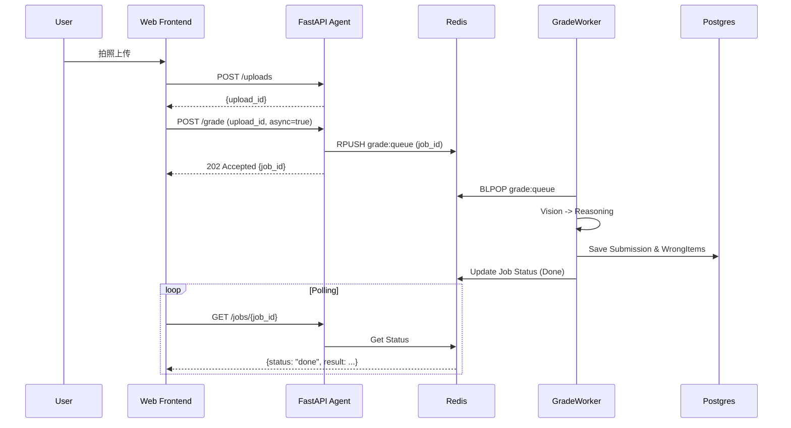
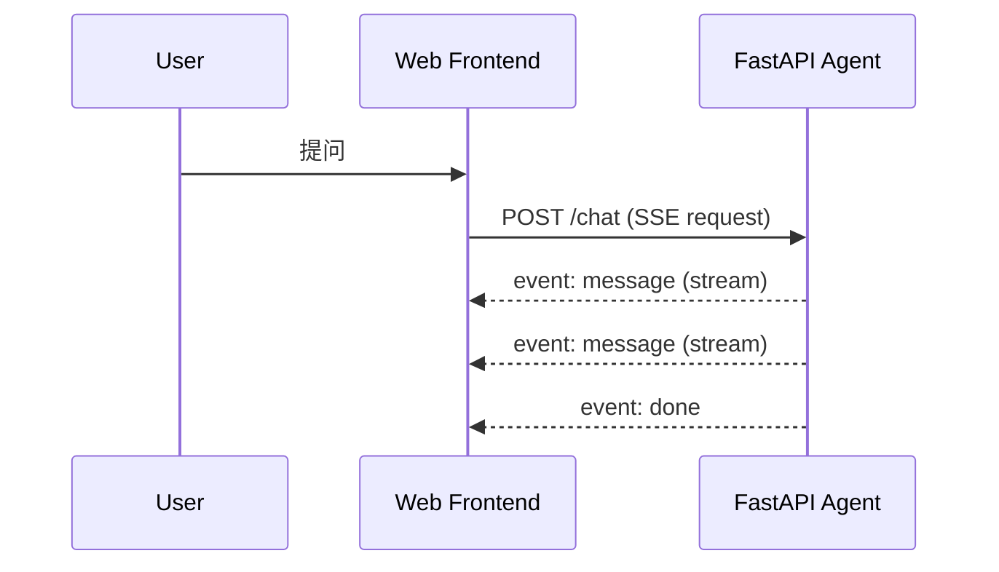

# System Architecture Design

## 1. 架构总览 (Architecture Overview)

当前仓库聚焦 **Python Agent 服务 + 多 Worker 集群** 的后端实现（FastAPI + Redis + Supabase）。前端（React）直连后端，无需 BFF 层。

```mermaid
graph TD
    subgraph Client [Client Side: React Frontend]
        Web[Web App / H5]
    end

    subgraph Backend [Backend (FastAPI + Workers)]
        API[FastAPI Agent Service]
        GradeWorker[grade_worker]
        QindexWorker[qindex_worker]
        FactsWorker[facts_worker]
        ReportWorker[report_worker]
        ReviewWorker[review_cards_worker]
        ExpiryWorker[expiry_worker]
        Redis[(Redis: cache + queue)]
    end

    subgraph Data [Data Layer (PolarDB for Supabase)]
        PG[(PostgreSQL: structured data)]
        Storage[(Object Storage: pages/slices)]
    end

    Web -->|HTTP / SSE| API
    API -->|Store files| Storage
    API -->|CRUD| PG
    API -->|Enqueue jobs| Redis
    
    GradeWorker -->|BLPOP| Redis
    QindexWorker -->|BLPOP| Redis
    FactsWorker -->|BLPOP| Redis
    ReportWorker -->|BLPOP| Redis
    ReviewWorker -->|BLPOP| Redis
    ExpiryWorker -->|Cleanup| PG
```

## 2. 技术选型 (Tech Stack)

### 2.1 前端层 (Frontend)
*   **Location**: `homework_frontend/` (React + TypeScript + Vite)
*   **Stack**: React 19, Tailwind CSS, axios, SWR, react-router-dom
*   **Responsibilities**:
    *   用户界面与交互
    *   直接调用后端 API (axios + SWR)
    *   状态管理 (SWR cache)
    *   SSE 流式响应处理

### 2.2 BFF 策略 (Backend for Frontend)

**当前决策**: ❌ **不引入 BFF 层**

理由:
1. **架构简单**: 前端 (React) → 后端 (FastAPI) 直连足够清晰
2. **鉴权完善**: FastAPI 已实现完整 JWT 鉴权 (`/auth/*` endpoints)
3. **SSE 支持**: 后端直接支持 SSE 流式响应 (`/chat`)
4. **性能充足**: FastAPI 异步性能足够支撑当前负载
5. **维护成本**: 减少一层部署和运维复杂度

**未来可能引入 BFF 的条件**:
- 支持多客户端生态 (iOS / Android / HarmonyOS 原生 App)
- 需要对接第三方登录 (微信 / 支付宝 / Apple ID)
- 需要复杂的边缘缓存策略
- 需要协议转换 (GraphQL / gRPC)

**如果未来需要，推荐方案**:
- 轻量级: Next.js API Routes
- 网关层: 阿里云 API Gateway / Kong
- Serverless: 阿里云函数计算

### 2.3 AI 核心层 (AI Engine)
*   **Language**: Python 3.10+
*   **Framework**: **FastAPI** (高性能异步 Web 框架)。
*   **Responsibilities**:
    *   `/uploads`: 后端权威上传（将原始文件落到 Storage，返回 `upload_id/page_image_urls`）。
    *   `/grade`: 统一阅卷 Agent（支持同步/异步）。异步模式下将任务推入 Redis 队列，由 `grade_worker` 处理。
    *   `/chat`: SSE 辅导；基于 `submissions` 快照进行辅导，支持"复习模式"（Rehydrate）。
    *   **Worker Cluster** (6 workers):
        *   `grade_worker`: 异步批改主进程 (grade:queue)
        *   `qindex_worker`: 题目定位(bbox) + 切片裁剪上传 (qindex:queue)
        *   `facts_worker`: 提取事实特征 (facts:queue)
        *   `report_worker`: 生成学情报告 (report:queue)
        *   `review_cards_worker`: 生成复习卡片 (review_cards:queue)
        *   `expiry_worker`: 清理过期数据 (TTL management)

### 2.4 数据存储 (Storage)
*   **PostgreSQL (Supabase-compatible)**：用户/Submission/报告等结构化数据（长期保留，支持按时间查询）。
*   **Object Storage (Supabase-compatible Storage)**：原始图片、proxy 轻量副本、切片（切片默认 24h TTL）。
*   **Redis**：缓存（Session/Quota）与 队列（`grade:queue`, `qindex:queue`, `report:queue` 等）。

## 3. 核心交互流程 (Interaction Flow)

### 3.1 异步批改流程 (Async Grading)


### 3.2 SSE 辅导流程 (Socratic Tutoring)


## 4. 部署架构 (Deployment)

### 4.1 阿里云部署 (ACK + ECI + PolarDB)

```
┌─────────────────────────────────────────┐
│              ACK Cluster                │
│  ┌─────────────────────────────────┐   │
│  │  API Deployment (HPA)           │   │
│  │  ├─ FastAPI App (3 replicas)    │   │
│  │  └─ Horizontal Pod Autoscaler   │   │
│  └─────────────────────────────────┘   │
│                                         │
│  ┌─────────────────────────────────┐   │
│  │  Worker Pool (KEDA)             │   │
│  │  ├─ grade_worker (ECI burst)    │   │
│  │  ├─ qindex_worker               │   │
│  │  ├─ facts_worker                │   │
│  │  ├─ report_worker               │   │
│  │  ├─ review_cards_worker         │   │
│  │  └─ expiry_worker               │   │
│  └─────────────────────────────────┘   │
└──────────────────┬──────────────────────┘
                   │
┌──────────────────▼──────────────────────┐
│           PolarDB for Supabase          │
│  ├─ PostgreSQL (主从架构)                │
│  ├─ Storage (内置对象存储)               │
│  └─ PostgREST/Auth/Realtime (可选)      │
└─────────────────────────────────────────┘
```

### 4.2 启动命令

**API 服务**:
```bash
export PYTHONPATH=$(pwd)
uvicorn homework_agent.main:app --host 0.0.0.0 --port 8000 --reload
```

**Worker 集群**:
```bash
python3 -m homework_agent.workers.grade_worker
python3 -m homework_agent.workers.qindex_worker
python3 -m homework_agent.workers.facts_worker
python3 -m homework_agent.workers.report_worker
python3 -m homework_agent.workers.review_cards_worker
python3 -m homework_agent.workers.expiry_worker
```
