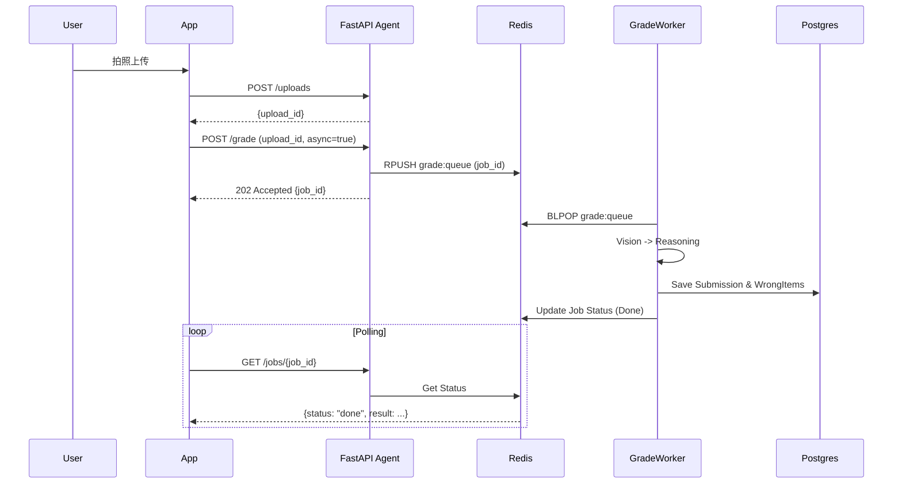

# System Architecture Design

## 1. 架构总览 (Architecture Overview)

当前仓库聚焦 **Python Agent 服务 + 多 Worker 集群** 的后端实现（FastAPI + Redis + Supabase）。Node.js BFF/前端属于后续工程，不在本仓库范围内；文档中仅保留为“可选上层”。

```mermaid
graph TD
    subgraph Client [Client Side: iOS / Android / Harmony / H5]
        App[Mobile App / Web]
    end

    subgraph Backend [Backend (This Repo)]
        API[FastAPI Agent Service]
        GradeWorker[grade_worker]
        QindexWorker[qindex_worker]
        FactsWorker[facts_worker]
        ReportWorker[report_worker]
        ReviewWorker[review_cards_worker]
        Redis[(Redis: cache + queue)]
    end

    subgraph Data [Supabase]
        PG[(Postgres: submissions/user data)]
        Storage[(Storage: pages/slices/proxy)]
    end

    App -->|Upload file| API
    API -->|Store pages| Storage
    API -->|Write metadata| PG
    API -->|/grade (Async)| Redis
    API -->|/chat| API
    
    GradeWorker -->|BLPOP grade:queue| Redis
    GradeWorker -->|Vision/LLM| API
    GradeWorker -->|Update Job| Redis
    
    QindexWorker -->|BLPOP qindex:queue| Redis
    QindexWorker -->|Upload slices| Storage
    
    FactsWorker -->|BLPOP facts:queue| Redis
    ReportWorker -->|BLPOP report:queue| Redis
    
    App <-->|SSE /chat| API
```

## 2. 技术选型 (Tech Stack)

### 2.1 可选上层 (BFF & Business, Out of Scope)
*   **Language**: TypeScript / Node.js（可选）
*   **Responsibilities**:
    *   用户鉴权、业务聚合、与移动端的 SSE/WebSocket 连接管理（未来扩展点）。

### 2.2 AI 核心层 (AI Engine)
*   **Language**: Python 3.10+
*   **Framework**: **FastAPI** (高性能异步 Web 框架)。
*   **Responsibilities**:
    *   `/uploads`: 后端权威上传（将原始文件落到 Storage，返回 `upload_id/page_image_urls`）。
    *   `/grade`: 统一阅卷 Agent（支持同步/异步）。异步模式下将任务推入 Redis 队列，由 `grade_worker` 处理。
    *   `/chat`: SSE 辅导；基于 `submissions` 快照进行辅导，支持“复习模式”（Rehydrate）。
    *   **Worker Cluster**:
        *   `grade_worker`: 异步批改主进程。
        *   `qindex_worker`: 题目定位(bbox) + 切片裁剪上传（重任务离线化）。
        *   `facts_worker`: 提取事实特征。
        *   `report_worker`: 生成学情报告。
        *   `review_cards_worker`: 生成复习卡片。

### 2.3 数据存储 (Storage)
*   **PostgreSQL (Supabase Postgres)**：用户/Submission/报告等结构化数据（长期保留，支持按时间查询）。
*   **Object Storage (Supabase Storage)**：原始图片、proxy 轻量副本、切片（切片默认 24h TTL）。
*   **Redis**：缓存（Session/Quota）与 队列（`grade:queue`, `qindex:queue`, `report:queue` 等）。

## 3. 核心交互流程 (Interaction Flow)

### 3.1 异步批改流程 (Async Grading)

