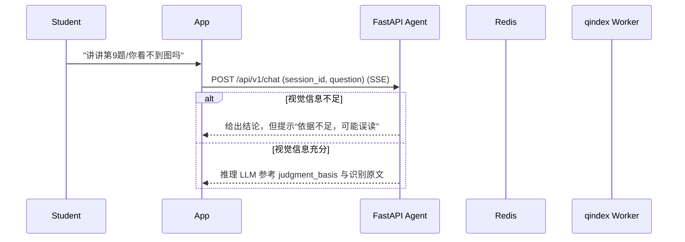

# System Architecture Design

## 1. 架构总览 (Architecture Overview)

当前仓库聚焦 **Python Agent 服务 + qindex worker** 的后端实现（FastAPI + Redis + Supabase）。Node.js BFF/前端属于后续工程，不在本仓库范围内；文档中仅保留为“可选上层”。

```mermaid
graph TD
    subgraph Client [Client Side: iOS / Android / Harmony]
        App[Mobile App]
    end

    subgraph Backend [Backend (This Repo)]
        API[FastAPI Agent Service]
        Worker[qindex Worker]
        Redis[(Redis: cache + queue)]
    end

    subgraph Data [Supabase]
        PG[(Postgres: submissions/user data)]
        Storage[(Storage: pages/slices/proxy)]
    end

    App -->|Upload file| API
    API -->|Store pages| Storage
    API -->|Write metadata| PG
    API -->|/grade| API
    API -->|enqueue qindex| Redis
    Worker -->|BRPOP queue| Redis
    Worker -->|Download pages| Storage
    Worker -->|Upload slices| Storage
    Worker -->|Write qindex:{session_id}| Redis
    App <-->|SSE /chat| API
```

## 2. 技术选型 (Tech Stack)

### 2.1 可选上层 (BFF & Business, Out of Scope)
*   **Language**: TypeScript / Node.js（可选）
*   **Responsibilities**:
    *   用户鉴权、业务聚合、与移动端的 SSE/WebSocket 连接管理（未来扩展点）。

### 2.2 AI 核心层 (AI Engine)
*   **Language**: Python 3.10+
*   **Framework**: **FastAPI** (高性能异步 Web 框架)。
*   **Responsibilities**:
    *   `/uploads`: 后端权威上传（将原始文件落到 Storage，返回 `upload_id/page_image_urls`）。
    *   `/grade`: 统一阅卷 Agent（OpenCV 预处理 + 视觉理解 + 判题），产出 `vision_raw_text`、结构化批改结果与 `judgment_basis`，并写入 session/qbank（后续会持久化为 submissions）。
    *   `/chat`: SSE 辅导；只读取 `/grade` 产出的 `judgment_basis + vision_raw_text`，不做实时看图。若视觉信息不足，仍给结论但需提示“依据不足，可能误读”。若题目无法定位，返回候选题目列表供 UI 按钮选择。
    *   qindex worker: 题目定位(bbox) + 切片裁剪上传（重任务离线化）。

### 2.3 数据存储 (Storage)
*   **PostgreSQL (Supabase Postgres)**：用户/Submission/报告等结构化数据（长期保留，支持按时间查询）。
*   **Object Storage (Supabase Storage)**：原始图片、proxy 轻量副本、切片（切片默认 7 天 TTL）。
*   **Redis**：缓存与队列（`qbank/qindex/sess/mistakes` 以及 `qindex:queue`）。

## 3. 核心交互流程 (Interaction Flow)

### 3.1 异步批改流程 (Batch Grading)
```mermaid
sequenceDiagram
    participant User
    participant App
    participant API as FastAPI Agent
    participant Storage as Supabase Storage
    participant PG as Supabase Postgres
    participant Redis as Redis
    participant Worker as qindex Worker

    User->>App: 拍照上传 (Math/English)
    App->>API: POST /api/v1/uploads (file, X-User-Id)
    API->>Storage: Upload pages (users/{user_id}/uploads/{upload_id}/...)
    API->>PG: Insert metadata (upload_id/session_id/page_image_urls...)
    API-->>App: {upload_id,page_image_urls}

    App->>API: POST /api/v1/grade (upload_id, subject, vision_provider)
    API->>API: Vision -> Grade -> Persist qbank/mistakes (Redis; 后续落库为 submissions)
    API-->>App: GradeResponse (summary/wrong_items/warnings/vision_raw_text/session_id)

    alt 需要切片
        API->>Redis: enqueue qindex job (session_id, page_urls, allowlist)
        Worker->>Redis: BRPOP qindex:queue
        Worker->>Storage: download pages + upload slices
        Worker->>Redis: write qindex:{session_id}
    end
```

### 3.2 错题辅导流程 (Socratic Tutoring)

